# 🐳 Curso Completo de Docker - Guía Definitiva

Bienvenido a la guía completa de Docker. Este documento consolida todos los módulos y actividades del curso, proporcionando una referencia rápida y exhaustiva para el despliegue de aplicaciones mediante contenedores.

---

## 📑 Tabla de Contenidos

1. [**Introducción a los Contenedores Docker**](#1-introducción-a-los-contenedores-docker)
   - [Instalación de Docker Engine](#instalación-de-docker-engine)
   - [El "Hola Mundo" de Docker](#el-hola-mundo-de-docker)
   - [Ejecución simple de contenedores](#ejecución-simple-de-contenedores)
   - [Ejecutando un contenedor interactivo](#ejecutando-un-contenedor-interactivo)
   - [Creando un contenedor demonio](#creando-un-contenedor-demonio)
   - [Creando un contenedor con un servidor web](#creando-un-contenedor-con-un-servidor-web)
   - [Configuración con variables de entorno](#configuración-de-contenedores-con-variables-de-entorno)
2. [**Imágenes Docker**](#2-imágenes-docker)
   - [Registros de imágenes: Docker Hub](#registros-de-imágenes-docker-hub)
   - [Gestión de imágenes](#gestión-de-imágenes)
   - [Organización de las imágenes](#cómo-se-organizan-las-imágenes)
   - [Creación de contenedores desde imágenes](#creación-de-contenedores-desde-imágenes)
   - [Ejemplo: Desplegando MediaWiki](#ejemplo-desplegando-la-aplicación-mediawiki)
3. [**Almacenamiento y Redes en Docker**](#3-almacenamiento-y-redes-en-docker)
   - [Volúmenes y Bind Mount](#volúmenes-docker-y-bind-mount)
   - [Asociando Volúmenes Docker](#asociando-almacenamiento-a-los-contenedores-volúmenes-docker)
   - [Asociando Bind Mount](#asociando-almacenamiento-a-los-contenedores-bind-mount)
   - [Redes en Docker](#redes-en-docker)
   - [Redes definidas por el usuario](#redes-definidas-por-el-usuario)
   - [Ejemplo 1: Guestbook](#ejemplo-1-despliegue-de-la-aplicación-guestbook)
   - [Ejemplo 2: Temperaturas](#ejemplo-2-despliegue-de-la-aplicación-temperaturas)
   - [Ejemplo 3: Wordpress + MariaDB](#ejemplo-3-despliegue-de-wordpress--mariadb)
   - [Ejemplo 4: Tomcat + Nginx](#ejemplo-4-despliegue-de-tomcat--nginx)
4. [**Escenarios Multicontenedor con Docker Compose**](#4-creando-escenarios-multicontenedor-con-docker-compose)
   - [Introducción a Docker Compose](#creando-escenarios-multicontenedor-con-docker-compose-1)
   - [El fichero docker-compose.yaml](#el-fichero-docker-composeyaml)
   - [El comando docker compose](#el-comando-docker-compose)
   - [Almacenamiento con Docker Compose](#almacenamiento-con-docker-compose)
   - [Ejemplo 1: Guestbook con Compose](#ejemplo-1-despliegue-de-la-aplicación-guestbook-1)
   - [Ejemplo 2: Temperaturas con Compose](#ejemplo-2-despliegue-de-la-aplicación-temperaturas-1)
   - [Ejemplo 3: WordPress con Compose](#ejemplo-3-despliegue-de-wordpress--mariadb-1)
   - [Ejemplo 4: Tomcat + Nginx con Compose](#ejemplo-4-despliegue-de-tomcat--nginx-1)
5. [**Creación de Imágenes en Docker**](#5-creación-de-imágenes-en-docker)
   - [Imágenes a partir de un contenedor](#creación-de-una-nueva-imagen-a-partir-un-contenedor)
   - [Imágenes a partir de un Dockerfile](#creación-de-imágenes-con-fichero-dockerfile)
   - [Distribución de imágenes](#distribución-de-imágenes)
   - [Ejemplo 1: Página estática](#ejemplo-1-construcción-de-imágenes-con-una-página-estática)
   - [Ejemplo 2: Aplicación PHP](#ejemplo-2-construcción-de-imágenes-con-una-una-aplicación-php)
   - [Ejemplo 3: Aplicación Python](#ejemplo-3-construcción-de-imágenes-con-una-una-aplicación-python)
   - [Ejemplo 4: Variables de entorno en imágenes](#ejemplo-4-construcción-de-imágenes-configurables-con-variables-de-entorno)
   - [Ciclo de vida de las aplicaciones](#ciclo-de-vida-de-las-aplicaciones)

---


# 1. Introducción a los Contenedores Docker

## Instalación de docker

# 1. Introducción a los Contenedores Docker

## Instalación de Docker Engine

**Docker Engine** está disponible en varias distribuciones de Linux, macOS y Windows 10 a través de Docker Desktop y como instalación binaria estática.

En este apartado vamos a realizar la instalación de Docker Engine sobre una distribución Linux. Puedes seguir la [documentación oficial](https://docs.docker.com/engine/install/) para aprender el método de instalación en otros sistemas.

### Instalación rápida (recomendada para desarrollo)

La forma más rápida es usar el script oficial de Docker, que detecta automáticamente tu distribución y realiza todo el proceso:

```bash
curl -fsSL https://get.docker.com | sh
```

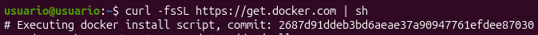

> **Nota de seguridad:** Si quieres revisar qué hará el script antes de ejecutarlo:
> ```bash
> curl -fsSL https://get.docker.com -o get-docker.sh
> sh get-docker.sh --dry-run
> ```

Para manejar Docker con un usuario sin privilegio, añade el usuario al grupo `docker`:

```bash
sudo usermod -aG docker $USER && su - $USER
```

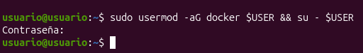

Comprueba que la instalación es correcta:

```bash
docker --version
# Docker version 24.0.7, build afdd53b
```
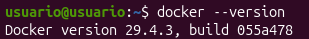
---

Ahora como vamos a poner mucho código y no quiero escribirlo todo porque soy bastante perezoso he instalado open ssh:

```bash
sudo apt install openssh-server -y
```

y también zerotier, he creado una red y he conectado mi ordenador de casa con la VM para que se pudiesen ver entre sí, a continuación me conecto por ssh desde WARP que es una consola que tiene IA integrada y ayuda a completar las ordenes más rápidas


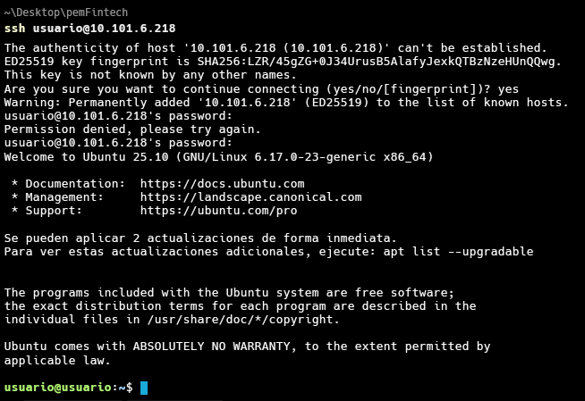


## El "Hola Mundo" de docker

Vamos a comprobar que todo funciona creando nuestro primer contenedor desde la imagen `hello-world`:

```bash
$ docker run hello-world
Unable to find image 'hello-world:latest' locally
latest: Pulling from library/hello-world
0e03bdcc26d7: Pull complete 
Digest:     sha256:31b9c7d48790f0d8c50ab433d9c3b7e17666d6993084c002c2ff1ca09b96391d
Status: Downloaded newer image for hello-world:latest

Hello from Docker!
This message shows that your installation appears to be working     correctly.

To generate this message, Docker took the following steps:
 1. The Docker client contacted the Docker daemon.
 2. The Docker daemon pulled the "hello-world" image from the Docker Hub.
    (amd64)
 3. The Docker daemon created a new container from that image which runs    the
    executable that produces the output you are currently reading.
 4. The Docker daemon streamed that output to the Docker client, which  sent it
    to your terminal.

To try something more ambitious, you can run an Ubuntu container with:
 $ docker run -it ubuntu bash

Share images, automate workflows, and more with a free Docker ID:
 https://hub.docker.com/

For more examples and ideas, visit:
 https://docs.docker.com/get-started/
```

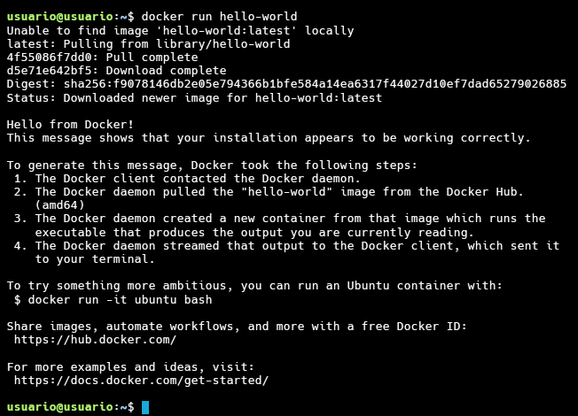

Pero, ¿qué es lo que está sucediendo al ejecutar esa orden?:

* Al ser la primera vez que ejecuto un contenedor basado en esa imagen, la imagen `hello-word` se descarga desde el repositorio que se encuentra en el registro que vayamos a utilizar, en nuestro caso DockerHub.
* Muestra el mensaje de bienvenida que es la consecuencia de ejecutar un comando al crear y arrancar un contenedor basado en esa imagen.

Si listamos los contenedores que se están ejecutando (`docker ps`):

```bash
$ docker ps
CONTAINER ID        IMAGE               COMMAND             CREATED             STATUS              PORTS               NAMES
```
Comprobamos que este contenedor no se está ejecutando. **Un contenedor ejecuta un proceso y cuando termina la ejecución, el contenedor se para.**

Para ver los contenedores que no se están ejecutando:

```bash
$ docker ps -a
CONTAINER ID        IMAGE               COMMAND             CREATED             STATUS                     PORTS               NAMES
372ca4634d53        hello-world         "/hello"            8 minutes ago       Exited (0) 8 minutes ago                       elastic_johnson
```

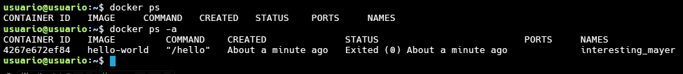

Para eliminar el contenedor podemos identificarlo con su `id`:

```bash
$ docker rm 372ca4634d53
```

o con su nombre:

```bash
$ docker rm elastic_johnson
```

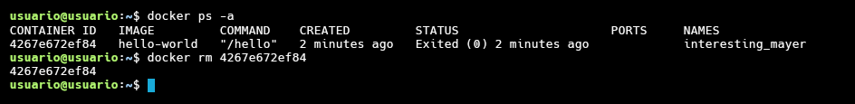


## Ejecución simple de contenedores

Con el comando `run` vamos a crear un contenedor donde vamos a ejecutar un comando, en este caso vamos a crear el contenedor a partir de una imagen ubuntu. Como todavía no hemos descargado ninguna imagen del registro docker hub, es necesario que se descargue la  imagen. Si la tenemos ya en nuestro ordenador no será necesario la descarga. 

```bash
$ docker run ubuntu echo 'Hello world' 
Unable to find image 'ubuntu:latest' locally
latest: Pulling from library/ubuntu
8387d9ff0016: Pull complete 
...
Status: Downloaded newer image for ubuntu:latest
Hello world
```

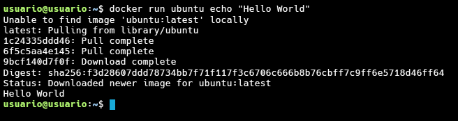

Comprobamos que el contenedor ha ejecutado el comando que hemos indicado y se ha parado:

```bash
$ docker ps -a
CONTAINER ID        IMAGE              COMMAND                  CREATED               STATUS                      PORTS               NAMES
3bbf39d0ec26        ubuntu              "echo 'Hello wo…"   31 seconds ago      Exited     (0) 29 seconds ago                       wizardly_edison
```


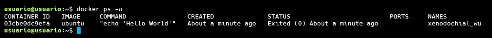

Con el comando `docker images` podemos visualizar las imágenes que ya tenemos descargadas en nuestro registro local:

```bash
$ docker images
REPOSITORY          TAG                 IMAGE ID           CREATED             SIZE
ubuntu              latest              f63181f19b2f        7 days ago          72.9MB
hello-world         latest              bf756fb1ae65        13 months ago       13.3kB
```


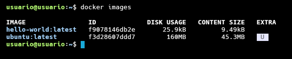


## Ejecutando un contenedor interactivo

En este caso usamos la opción `-i` para abrir una sesión interactiva, `-t` nos permite crear un pseudo-terminal que nos va a permitir interaccionar con el contenedor, indicamos un nombre del contenedor con la opción `--name`, y la imagen que vamos a utilizar para crearlo, en este caso `ubuntu`,  y por último el comando que vamos a ejecutar, en este caso `bash`, que lanzará una sesión bash en el contenedor:

```bash
$  docker run -it --name contenedor1 ubuntu bash 
root@2bfa404bace0:/#
```

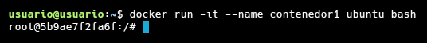

El contenedor se para cuando salimos de él. Para volver a conectarnos a él:

```bash
$ docker start contenedor1
contenedor1
$ docker attach contenedor1
root@2bfa404bace0:/#
```

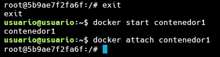


Si el contenedor se está ejecutando podemos ejecutar comandos en él con el subcomando `exec`:

```bash
$ docker start contenedor1
contenedor1
$ docker exec contenedor1 ls -al
```

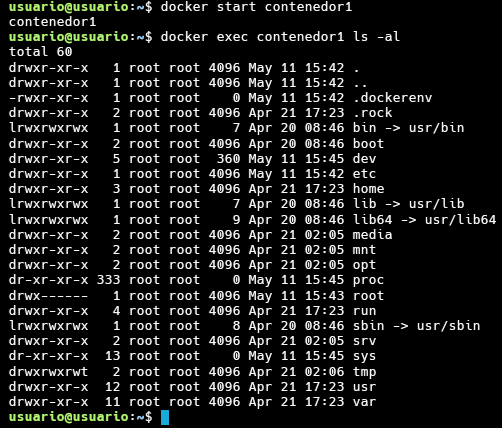

Con la orden `docker restart` reiniciamos el contenedor, lo paramos y lo iniciamos.

Para mostrar información de un contenedor ejecutamos `docker inspect`:

```bash
$ docker inspect contenedor1 
[
    {
        "Id": "178871769ac2fcbc1c73ce378066af01436b52a15894685b7321088468a25db7",
        "Created": "2021-01-28T19:12:21.764255155Z",
        "Path": "bash",
        "Args": [],
        "State": {
            "Status": "exited",
            "Running": false,
            "Paused": false,
            ...
```
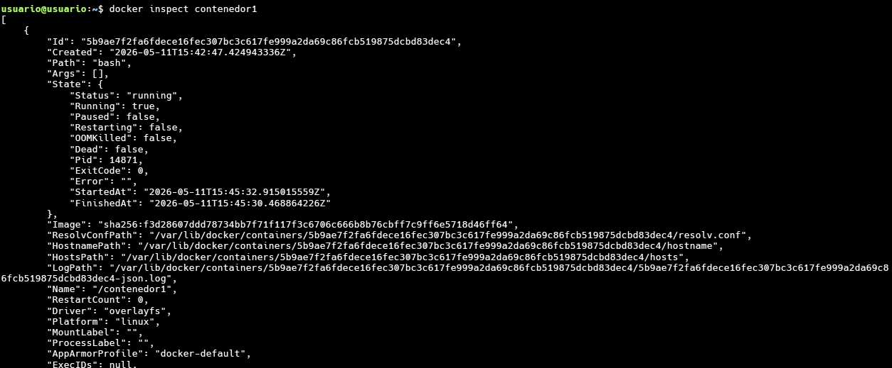

Nos muestra mucha información, está en formato JSON (JavaScript Object Notation) y nos da datos sobre aspectos como:

* El id del contenedor.
* Los puertos abiertos y sus redirecciones
* Los *bind mounts* y volúmenes usados.
* El tamaño del contenedor
* La configuración de red del contenedor.
* El *ENTRYPOINT* que es lo que se ejecuta al hacer docker run.
* El valor de las variables de entorno.
* Y muchas más cosas....

En realidad, todas las imágenes tienen definidas un proceso que se ejecuta, en concreto la imagen `ubuntu` tiene definida por defecto el proceso `bash`, por lo que podríamos haber ejecutado:

```bash
$ docker run -it --name contenedor1 ubuntu
```


## Creando un contenedor demonio

En esta ocasión hemos utilizado la opción `-d` del comando `run`, para que la ejecución del comando en el contenedor se haga en segundo plano.

```bash
$ docker run -d --name contenedor2 ubuntu bash -c "while true; do echo hello world; sleep 1; done"
7b6c3b1c0d650445b35a1107ac54610b65a03eda7e4b730ae33bf240982bba08
```
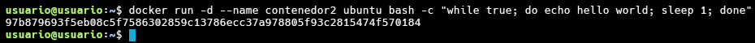

> NOTA: En la instrucción `docker run` hemos ejecutado el comando con `bash -c` que nos permite ejecutar uno o mas comandos en el contenedor de forma más compleja (por ejemplo, indicando ficheros dentro del contenedor).

* Comprueba que el contenedor se está ejecutando
* Comprueba lo que está haciendo el contenedor (`docker logs contenedor2`)

Por último podemos parar el contenedor y borrarlo con las siguientes instrucciones:

```bash
$ docker stop contenedor2
$ docker rm contenedor2
```
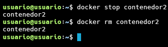

Hay que tener en cuenta que un contenedor que esta ejecutándose no puede ser eliminado. Tendríamos que para el contenedor y posteriormente borrarlo. Otra opción es borrarlo a la fuerza:

```bash
$ docker rm -f contenedor2
```

## Creando un contenedor con un servidor web

Tenemos muchas imágenes en el registro público **docker hub**, por ejemplo podemos crear un servidor web con apache 2.4:

```bash
$ docker run -d --name my-apache-app -p 8080:80 httpd:2.4
```

Vemos que el contenedor se está ejecutando, además con la opción `-p` mapeamos un puerto del equipo donde tenemos instalado el docker, con un puerto del contenedor: Si accedemos a la ip del ordenador que tiene instalado docker al primer puerto indicado, se redigira la petición a la ip del contenedor al segundo puerto indicado. **Nunca utilizamos directamente la ip del contenedor para acceder a él**. 

Para probarlo accede desde un navegador a **la ip del servidor con docker (en mi caso: 192.168.121.54 y al puerto 8080**:

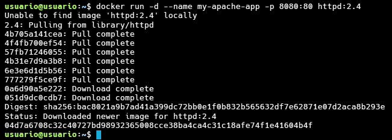

Para acceder al log del contenedor podemos ejecutar:

```bash
$ docker logs my-apache-app
```
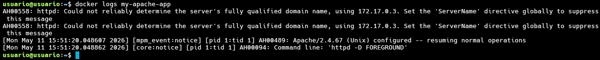

Con la opción `logs -f` seguimos visualizando los logs en tiempo real.

### Modificación del contenido servidor por el servidor web

Si consultamos la documentación de la imagen [`httpd`](https://hub.docker.com/_/httpd) en el registro docker Hub, podemos determinar que le servidor web que se ejecuta en el contenedor guardar sus ficheros (directorio *DocumentRoot*) en `/usr/local/apache2/htdocs/`. Vamos a crear un nu nuevo fichero `index.html` en ese directorio.

Lo podemos hacer de varias formas:

* Accediendo de forma interactiva al contenedor y haciendo la modificación:

```bash
$ docker exec -it my-apache-app bash

root@cf3cd01a4993:/usr/local/apache2# cd /usr/local/apache2/htdocs/
root@cf3cd01a4993:/usr/local/apache2/htdocs# echo "<h1>Curso Docker</h1>" > index.html
root@cf3cd01a4993:/usr/local/apache2/htdocs# exit
```

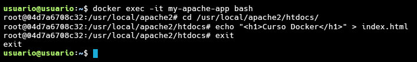

* Ejecutando directamente el comando de creación del fichero `index.html` en el contenedor:

```bash
$ docker exec my-apache-app bash -c 'echo "<h1>Curso Docker</h1>" > /usr/local/apache2/htdocs/index.html'
```
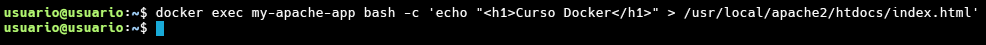

Independientemente de cómo hayamos creado el fichero, podemos volver a acceder al servidor web y comprobar que efectivamente hemos cambiado el contenido del `index.html`:

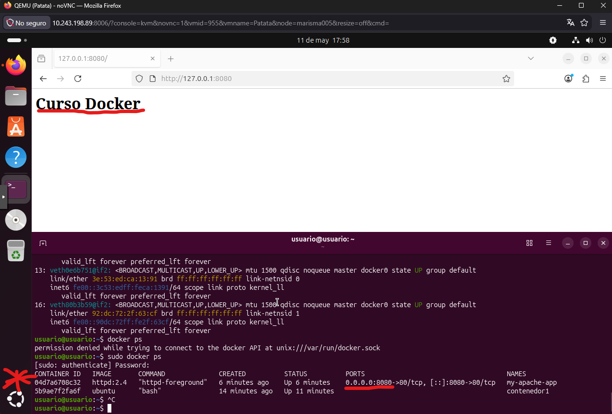


## Configuración de contenedores con variables de entorno

Más adelante veremos que al crear un contenedor que necesita alguna configuración específica, lo que vamos a hacer es crear variables de entorno en el contenedor, para que el proceso que inicializa el contenedor pueda realizar dicha configuración.

Para crear una variable de entorno al crear un contenedor usamos el flag `-e` o `--env`:

```bash
$ docker run -it --name prueba -e USUARIO=prueba ubuntu bash
root@91e81200c633:/# echo $USUARIO
prueba
```

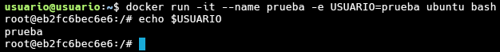

### Configuración de un contenedor con la imagen mariadb

En ocasiones es obligatorio el inicializar alguna variable de entorno para que el contenedor pueda ser ejecutado. Si miramos la [documentación](https://hub.docker.com/_/mariadb) en Docker Hub de la imagen mariadb, observamos que podemos definir algunas variables de entorno para la creación y configuración del contenedor (por ejemplo: `MARIADB_DATABASE`,`MARIADB_USER`, `MARIADB_PASSWORD`,...). Pero hay una que la tenemos que indicar de forma obligatoria, la contraseña del usuario `root` (`MARIADB_ROOT_PASSWORD`), por lo tanto:

```bash
$ docker run -d --name some-mariadb -e MARIADB_ROOT_PASSWORD=my-secret-pw mariadb
$ docker ps
CONTAINER ID        IMAGE               COMMAND                  CREATED                STATUS              PORTS               NAMES
9c3effd891e3        mariadb             "docker-entrypoint.s…"   8 seconds ago       Up 7   seconds        3306/tcp            some-mariadb
```
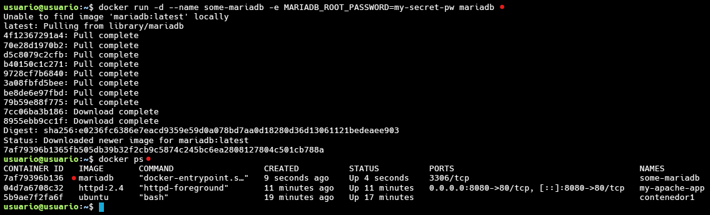

Podemos ver que se ha creado una variable de entorno:

```bash
$ docker exec -it some-mariadb env
...
MARIADB_ROOT_PASSWORD=my-secret-pw
...
```
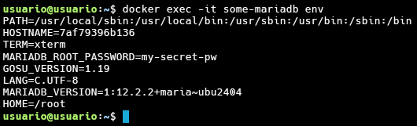

Y para acceder podemos ejecutar:

```bash
$ docker exec -it some-mariadb bash                                  
root@9c3effd891e3:/# mariadb -u root -p"$MARIADB_ROOT_PASSWORD" 
...

MariaDB [(none)]> 
```
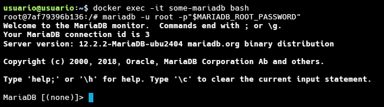

Otra forma de hacerlo sería:

```bash
$ docker exec -it some-mariadb mariadb -u root -p
Enter password: 
...
MariaDB [(none)]> 
```


#### Accediendo a servidor de base de datos desde el exterior

En el ejemplo anterior hemos accedido a la base de datos de dos formas: 

1. Ejecutado un comando `bash` para acceder al contenedor y desde dentro hemos utilizado el cliente de mariadb para acceder a la base de datos.
2. Ejecutando directamente en el contenedor el cliente de mariadb.

En esta ocasión vamos a mapear los puertos para acceder desde el exterior a la base de datos:

Lo primero que vamos a hacer es eliminar el contenedor anterior:

```bash 
$ docker rm -f some-mariadb
```

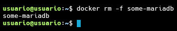

Y a continuación vamos a crear otro contenedor, pero en esta ocasión vamos a mapear el puerto 3306 del anfitrión con el puerto 3306 del contenedor:

```bash 
docker run -d -p 3306:3306 --name some-mariadb -e MARIADB_ROOT_PASSWORD=my-secret-pw mariadb
```

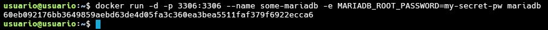

Comprobamos que los puertos se han mapeado y que el contenedor está ejecutándose:

```bash
$ docker ps
CONTAINER ID        IMAGE               COMMAND                  CREATED             STATUS              PORTS                    NAMES
816ea7df5c41        mariadb             "docker-entrypoint.s…"   3 seconds ago       Up 2 seconds        0.0.0.0:3306->3306/tcp   some-mariadb
```

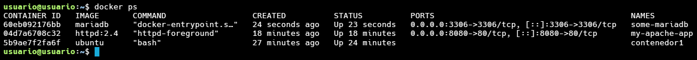

Ahora desde nuestro equipo (donde hemos instalado un cliente de mysql) nos conectamos  que tiene la ip `192.168.121.54` vamos a conectarnos a la base de datos (hay que tener instalado el cliente de mariadb):

```bash
$ mysql -u root -p -h 192.168.121.54
Enter password: 
...
MariaDB [(none)]> 
```

También nos podemos conectar usando la dirección `127.0.0.1`:

```bash
$ mysql -u root -p -h 127.0.0.1
Enter password: 
...
MariaDB [(none)]> 
```


---
[⬆ Volver al índice](#📑-tabla-de-contenidos)

# 2. Imágenes Docker

## Registros de imágenes: Docker Hub


Las **imágenes** de Docker son plantillas de solo lectura, es decir, una imagen puede contener el sistema de archivo de un sistema operativo como Debian, pero esto solo nos permitirá crear los contenedores basados en esta configuración. Si hacemos cambios en el contenedor ya lanzado, al detenerlo esto no se verá reflejado en la imagen.

El **Registro docker** es un componente donde se almacena las imágenes generadas por el Docker Engine. Puede estar instalada en un servidor independiente y es un componente fundamental, ya que nos permite distribuir nuestras aplicaciones. Es un proyecto open source que puede ser instalado gratuitamente en cualquier servidor, pero, como hemos comentado, el proyecto nos ofrece Docker Hub.

El nombre de una imagen suele estar formado por tres partes:

    usuario/nombre:etiqueta

* `usuario`: El nombre del usuario que la ha generado. Si la subimos a Docker Hub debe ser el mismo usuario que tenemos dado de alta en nuestra cuenta. Las **imáges oficiales** en Docker Hub no tienen nombre de usuario.
* `nombre`: Nombre significativo de la imagen.
* `etiqueta`: Nos permite versionar las imágenes. De esta manera controlamos los cambios que se van produciendo en ella. Si no indicamos etiqueta, por defecto se usa la etiqueta `latest`, por lo que la mayoría de las imágenes tienen una versión con este nombre.


## Gestión de imágenes

Para crear un contenedor es necesario usar una imagen que tengamos descargado en nuestro registro local. Por lo tanto al ejecutar `docker run` se comprueba si tenemos la versión indicada de la imagen y si no es así, se precede a su descarga.

Las principales instrucciones para trabajar con imágenes son:

* `docker images`: Muestra las imágenes que tenemos en el registro local.
* `docker pull`: Nos permite descargar la última versión de la imagen indicada.
* `docker rmi`: Nos permite eliminar imágenes. No podemos eliminar una imágen si tenemos algún contenedor creada a partir de ella.
* `docker search`: Busca imágenes en Docker Hub.
* `docker inspect`: nos da información sobre la imágen indicada:
    * El id y el checksum de la imagen.
    * Los puertos abiertos.
    * La arquitectura y el sistema operativo de la imagen.
    * El tamaño de la imagen.
    * Los volúmenes.
    * El ENTRYPOINT que es lo que se ejecuta al hacer `docker run`.
    * Las capas.
    * Y muchas más cosas....


## ¿Cómo se organizan las imágenes?

Las imágenes están hechas de **capas ordenadas**. Puedes pensar en una capa como un conjunto de cambios en el sistema de archivos. Cuando tomas todas las capas y las apilas, obtienes una nueva imagen que contiene todos los cambios acumulados. 

Si tienes muchas imágenes basadas en capas similares, como Sistema Operativo base o paquetes comunes, entonces todas éstas capas comunes será almacenadas solo una vez.


Cuando un nuevo contenedor es creado desde una imagen, todas las capas de la imagen son únicamente de lectura y una delgada capa lectura-escritura es agregada arriba. Todos los cambios efectuados al contenedor específico son almacenados en esa capa. 

El contenedor no puede modificar los archivos desde su capa de imagen (que es sólo lectura). Creará una copia del fichero en su capa superior, y desde ese punto en adelante, cualquiera que trate de acceder al archivo obtendrá la copia de la capa superior. 


Por lo tanto cuando creamos un contenedor ocupa muy poco de disco duro, porque las capas de la imagen desde la que se ha creado se comparten con el contenedor:

Veamos el tamaño de nuestra imagen `ubuntu`:

```bash
$ docker images
REPOSITORY          TAG                 IMAGE ID            CREATED             SIZE
ubuntu              latest              f63181f19b2f        7 days ago          72.9MB
```

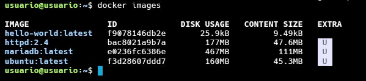

Si creamos un contenedor interactivo:

```bash
$ docker run -it --name contenedor1 ubuntu /bin/bash 
```

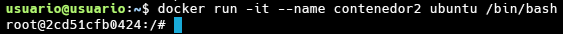

Nos salimos, y a continuación visualizamos los contenedores con la opción `-s` (size):

```bash
$ docker ps -a -s
CONTAINER ID        IMAGE               COMMAND                  CREATED             STATUS                       PORTS               NAMES               SIZE
a2d1ce6990d8        ubuntu              "/bin/bash"              8 seconds ago       Exited (130) 5 seconds ago                       contenedor1         0B (virtual 72.9MB)
```

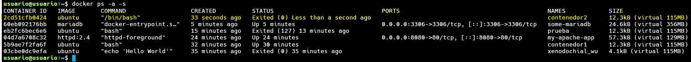

Nos damos cuenta que el tamaño real del contenedor es 0B y el virtual, el que comparte con la imagen son los 72,9MB que es el tamaño de la imagen ubuntu.

Si a continuación volvemos a acceder al contenedor y creamos un fichero:

```bash
$ docker start contenedor1
contenedor1
$ docker attach contenedor1
root@a2d1ce6990d8:/# echo "00000000000000000">file.txt
```

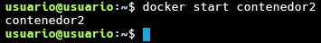

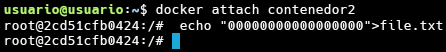

Y volvemos a ver el tamaño, vemos que ha crecido con la creación del fichero:

```bash
$ docker ps -a -s
CONTAINER ID        IMAGE               COMMAND                  CREATED             STATUS                      PORTS               NAMES               SIZE
a2d1ce6990d8        ubuntu              "/bin/bash"              56 seconds ago      Exited (0) 2 seconds ago                        contenedor1         52B (virtual 72.9MB)
```

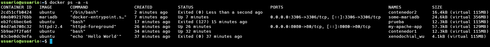

Por todo lo que hemos explicado, ahora se entiende  que **no podemos eliminar una imágen cuando tenemos contenedores creados a a partir de ella**.

Por último al solicitar información de la imágen, podemos ver información sobre las capas:

```bash
$ docker inspect ubuntu:latest
...
"RootFS": {
        "Type": "layers",
        "Layers": [
            "sha256:9f32931c9d28f10104a8eb1330954ba90e76d92b02c5256521ba864feec14009",
            "sha256:dbf2c0f42a39b60301f6d3936f7f8adb59bb97d31ec11cc4a049ce81155fef89",
            "sha256:02473afd360bd5391fa51b6e7849ce88732ae29f50f3630c3551f528eba66d1e"
        ]
...
```

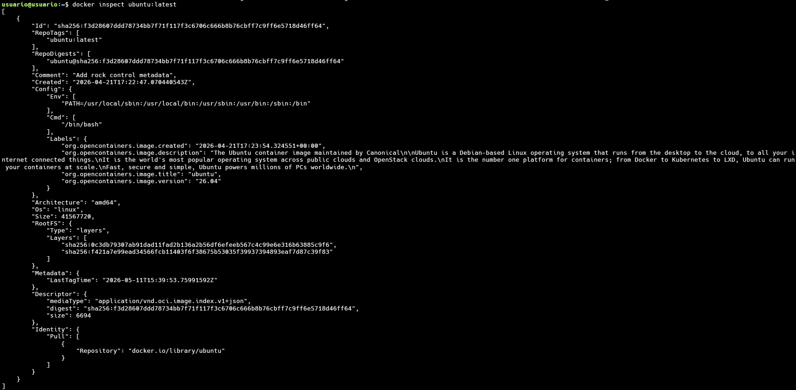


## Creación de contenedores desde imágenes

Si navegas un poco por las distintas imágenes que encuentras en el registro de Docker Hub, te darás cuenta, que existen tres tipos de imágenes según la utilidad que nos ofrecen.

* Ejecutaremos contenedores de distintos sistemas operativos (Ubuntu, CentOs, Debian, Fedora....).
* Ejecutaremos contenedores que tengan servicios asociados (Apache, MySQL, Tomcat....).
* Ejecutaremos contenedores que tengan servicios asociados y que tienen instalada alguna aplicación web (WordPress, Nextcloud,...)

Todas las imágenes tiene definidas un proceso que se ejecuta por defecto, pero en la mayoría de los casos podemos indicar un proceso al crear un contenedor.

Por ejemplo en la imagen `ubuntu` el proceso pode defecto es `bash`, por lo tanto podemos ejecutar:

```bash
$ docker run -it --name contenedor1 ubuntu 
```

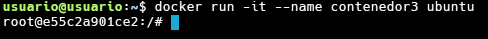

Pero podemos indicar el comando a ejecutar en la creación del contenedor:

```bash
$ docker run ubuntu /bin/echo 'Hello world'
```

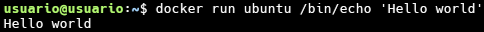

Otro ejemplo: la imagen `httpd:2.4` ejecuta un servidor web por defecto, por lo tanto al crear el contenedor:

```bash
$ docker run -d --name my-apache-app -p 8080:80 httpd:2.4
```


## Ejemplo: Desplegando la aplicación mediawiki

La mediawiki en una aplicación web escrita en PHP que nos permite gestionar una wiki. En este ejemplo vamos a hacer un ejemplo simple de despliegue en contenedor usando la imagen [`mediawiki`](https://hub.docker.com/_/mediawiki) que encontramos en DockerHub. 

En este ejemplo nos vamos a fijar cómo por medio de la etiqueta del nombre de la imagen podemos tener distintas versiones de la aplicación.

En concreto, si estudiamos la [documentación](https://hub.docker.com/_/mediawiki) de la imagen `mediawiki`, podemos ver las etiquetas disponibles para la imagen que corresponden a versiones distintas de la aplicación. En enero de 2024 serían las siguientes:


### La etiqueta `latest`

Si utilizamos el nombre de una imagen sin indicar la etiqueta, se toma por defecto la etiqueta `latest` que suele corresponder a la última versión de la aplicación. en el caso concreto de `mediawiki` observamos que la etiqueta `latest` corresponde a la última versión la `1.39.1`. Es más, podemos usar las siguientes etiquetas para indicar la misma versión: `1.41.0, 1.41, stable, latest`.

### Las imágenes bases y la arquitectura también son indicadas con las etiquetas

Podemos seguir observando que algunas etiquetas, nos indican además de la versión, los servicios que tienen instalada la imagen, por ejemplo si usamos la etiqueta `1.41.0-fpm` estaremos creando un contenedor con la ultima versión de la aplicación pero que además tendrá un servidor de aplicaciones php-fpm para servir la aplicación.

Otro ejemplo: si usamos la etiqueta `1.41.0-fpm-alpine`, además de la última versión y que tiene instalado php-fpm, nos indica que la imagen base que se ha usado para crear la imagen es una distribución `alpine` que se caracteriza por ser una distribución muy liviana.

### Instalación de distintas versiones de la mediawiki

Vamos a crear distintos contenedores usando etiquetas distintas al indicar el nombre de la imagen, posteriormente accederemos a la aplicación y podremos ver la versión instalada:

En primer lugar vamos a instalar la última versión:

```bash
docker run -d -p 8080:80 --name mediawiki1 mediawiki
```

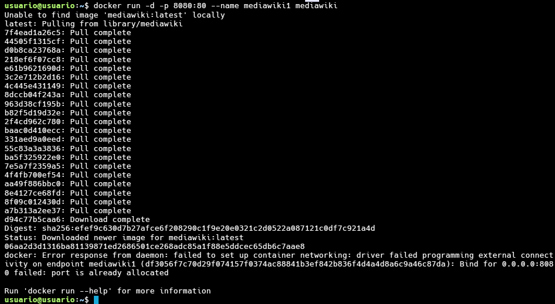


Si accedemos a la ip de nuestro ordenador, al puerto 8080, podemos observar que hemos instalado la versión 1.41.0:


A continuación vamos a instalar otra versión de la mediawiki, la 1.40.2, creamos otro contenedor con otro nombre y mapeamos otro puerto:

```bash
docker run -d -p 8081:80 --name mediawiki2 mediawiki:1.40.2
```

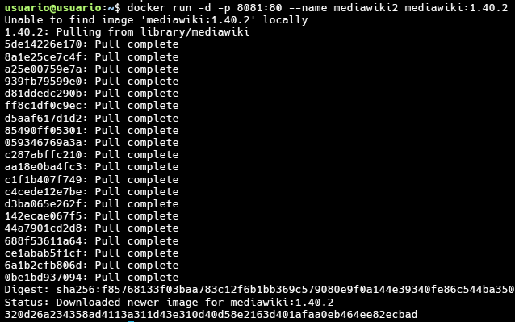

Si accedemos a la ip de nuestro ordenador, al puerto 8081, podemos observar que hemos instalado la versión 1.40.2:


Y finalmente vamos a instalar otra versión en otro contenedor:

```bash
docker run -d -p 8082:80 --name mediawiki3 mediawiki:1.39.6
```

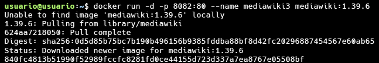

Si accedemos a la ip de nuestro ordenador, al puerto 8082, podemos observar que hemos instalado la versión 1.39.6:

**Nota: Puedes observar que la primera imagen que se baja, descargas todas las capas, sin embargo al descargar las otras versiones de la imagen, sólo se bajan las capas que difieren de la primera.**


---
[⬆ Volver al índice](#📑-tabla-de-contenidos)

# 3. Almacenamiento y Redes en Docker

## Volúmenes docker y bind mount

### Los contenedores son efímeros

**Los contenedores son efímeros**, es decir, los ficheros, datos y configuraciones que creamos en los contenedores sobreviven a las paradas de los mismos pero, sin embargo, son destruidos si el contenedor es destruido. 

### Los datos en los contenedores


Ante la situación anteriormente descrita Docker nos proporciona varias soluciones para persistir los datos de los contenedores. En este curso nos vamos a centrar en las dos que considero que son más importantes:

* Los **volúmenes docker**.
* Los **bind mount**
* Los **tmpfs mounts**: Almacenan en memoria la información. (No lo vamos a ver en este curso)

### Volúmenes docker

Si elegimos conseguir la persistencia usando volúmenes estamos haciendo que los datos de los contenedores que nosotros decidamos se almacenen en una parte del sistema de ficheros que es gestionada por docker y a la que, debido a sus permisos, sólo docker tendrá acceso. En linux se guardan en `/var/lib/docker/volumes`. Este tipo de volúmenes se suele usar en los siguiente casos:

* Para compartir datos entre contenedores. Simplemente tendrán que usar el mismo volumen.
* Para copias de seguridad ya sea para que sean usadas posteriormente por otros contenedores o para mover esos volúmenes a otros hosts.
* Cuando quiero almacenar los datos de mi contenedor no localmente si no en un proveedor cloud.

#### Gestionando volúmenes

Algunos comando útiles para trabajar con volúmenes docker:

* **docker volume create**: Crea un volumen con el nombre indicado.
* **docker volume rm**: Elimina el volumen indicado.
* **docker volume prune**: Para eliminar los volúmenes que no están siendo usados por ningún contenedor.
* **docker volume ls**: Nos proporciona una lista de los volúmenes creados y algo de información adicional.
* **docker volume inspect**: Nos dará una información mucho más detallada de el volumen que hayamos elegido.

### Bind mounts

Si elegimos conseguir la persistencia de los datos de los contenedores usando bind mount lo que estamos haciendo es "mapear" (montar) una parte de mi sistema de ficheros, de la que yo normalmente tengo el control, con una parte del sistema de ficheros del contenedor. Por lo tanto podemos montar tanto **directorios** como **ficheros**. De esta manera conseguimos:

* Compartir ficheros entre el host y los containers.
* Que otras aplicaciones que no sean docker tengan acceso a esos ficheros, ya sean código, ficheros etc...


## Asociando almacenamiento a los contenedores: volúmenes Docker

Veamos como puedo usar los volúmenes y los bind mounts en los contenedores. Aunque dos formas de asociar el almacenamiento al contenedor nosotros vamos a usar el flag `--volume` o `-v`.

Si usamos imágenes de DockerHub, debemos leer la información que cada imagen nos proporciona en su página ya que esa información suele indicar cómo persistir los datos de esa imagen, ya sea con volúmenes o bind mounts, y cuáles son las carpetas importantes en caso de ser imágenes que contengan ciertos servicios (web, base de datos etc...)

### Ejemplo usando volúmenes docker

Lo primero que vamos a hacer es crear un volumen docker:

```bash
$ docker volume create miweb
miweb
```

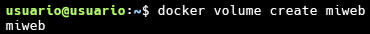

A continuación creamos un contenedor con el volumen asociado, usando `-v`, y creamos un fichero `index.html`:

```bash
$ docker run -d --name my-apache-app -v miweb:/usr/local/apache2/htdocs -p 8080:80 httpd:2.4
b51f89eb21701362279489c5b52a06b1a44c10194c00291de895b404ab347b80

$ docker exec my-apache-app bash -c 'echo "<h1>Hola</h1>" > /usr/local/apache2/htdocs/index.html'

$ curl http://localhost:8080
<h1>Hola</h1>

$ docker rm -f my-apache-app 
my-apache-app
```

En mi caos primero debemos parar el servicio anterior que ya usa ese puerto:

```bash
docker stop my-apache-app
docker rm my-apache-app
```

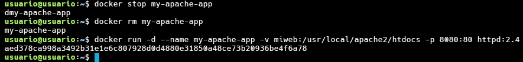


Después de borrar el contenedor, volvemos a crear otro contenedor con el mismo volumen asociado:

```bash
$ docker run -d --name my-apache-app -v miweb:/usr/local/apache2/htdocs -p 8080:80 httpd:2.4
baa3511ca2227e30d90fa2b4b225e209889be4badff583ce58ac1feaa73d5d77
```

Y podemos comprobar que no no se ha perdido la información (el fichero `index.html`):

```bash
$ curl http://localhost:8080
<h1>Hola</h1>
```

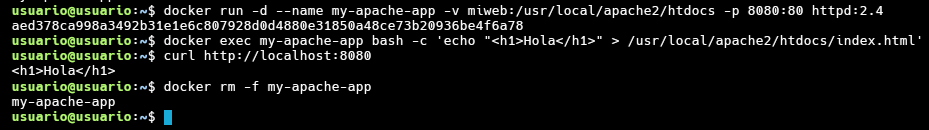

Algunas aclaraciones:

* Al no indicar el volumen, se creará un nuevo volumen.
* Si usamos el flag `-v` e indicamos un nombre, se creará un volumen docker nuevo.
* Al usar tanto volúmenes como bind mount, el contenido de lo que tenemos sobreescribirá la carpeta destino en el sistema de ficheros del contenedor en caso de que exista.


## Asociando almacenamiento a los contenedores: bind mount

### Ejemplo: montando directorios usando bind mount

En este caso vamos a crear un directorio en el sistema de archivo del host, donde vamos a crear un fichero `index.html`:

```bash
$ mkdir web
$ cd web
/web$ echo "<h1>Hola</h1>" > index.html
```

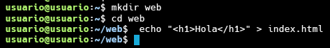

Y podemos montar ese directorio en un contenedor, en este caso usamos la opción `-v`:

```bash
$ docker run -d --name my-apache-app -v /home/usuario/web:/usr/local/apache2/htdocs -p 8080:80 httpd:2.4
8de025f6ff4d4b8a5a57d10a9cbb283b103209f358c43148a4716a33a404e208
```

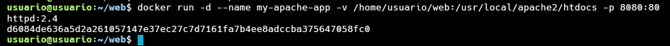

Y comprobamos que realmente estamos sirviendo el fichero que tenemos en el directorio que hemos creado.

```bash
$ curl http://localhost:8080
<h1>Hola</h1>
```

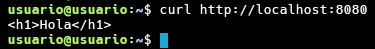

Eliminamos el contenedor y volvemos a crear otro con el directorio montado:

```bash
$ docker rm -f my-apache-app 
my-apache-app

$ docker run -d --name my-apache-app -v /home/usuario/web:/usr/local/apache2/htdocs -p 8080:80 httpd:2.4
1751b04b0548217d7faa628fd69c10e84c695b0e5cc33b482df2c04a6af83292

$ curl http://localhost:8080
<h1>Hola</h1>
```

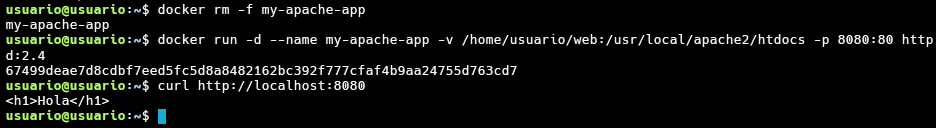

Además podemos comprobar que podemos modificar el contenido del fichero aunque este montado en el contenedor:

```bash
$ echo "<h1>Adios</h1>" > web/index.html 
$ curl http://localhost:8080
<h1>Adios</h1>
```
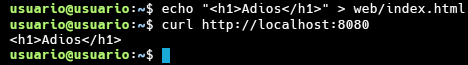


Por último, indicar que si nuestra carpeta origen no existe y hacemos un bind mount con `-v`, esa carpeta se creará pero lo que tendremos en el contenedor es una carpeta vacía. 


## Redes en Docker

### Tipos de redes en Docker

Cuando instalamos docker tenemos las siguientes redes predefinidas:

```bash
$ docker network ls
NETWORK ID          NAME                DRIVER              SCOPE
ec77cfd20583        bridge              bridge              local
69bb21378df5        host                host                local
089cc966eaeb        none                null                local
```

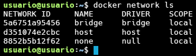

* Por defecto los contenedores que creamos se conectan a la red de tipo **bridge** llamada `bridge` (por defecto el direccionamiento de esta red es 172.17.0.0/16). Los contenedores conectados a esta red que quieren exponer algún puerto al exterior tienen que usar la opción `-p` para mapear puertos.

    Este tipo de red nos van a permitir: 

    * Aislar los distintos contenedores que tengo en distintas subredes docker, de tal manera que desde cada una de las subredes solo podremos acceder a los equipos de esa misma subred.
    * Aislar los contenedores del acceso exterior.
    * Publicar servicios que tengamos en los contenedores mediante redirecciones que docker implementará con las pertinentes reglas de iptables.


    Veamos un ejemplo:

    Vamos a crear un contenedor interactivos con la imagen `debian`:

    ```bash
    $ docker run -it --name contenedor1 --rm debian bash
    ```

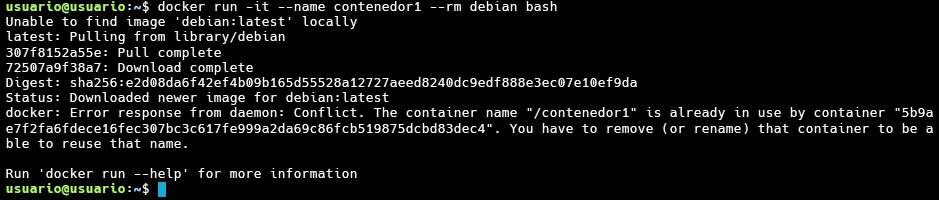
    
    **Nota: Hemos usado la opción `--rm` para al finalizar de ejecutar el proceso, el contenedor se elimina.**

    En otra pestaña, podemos ejecutar esta instrucción para obtener la ip que se le ha asignado:
    ```
    $ docker inspect -f '{{range.NetworkSettings.Networks}}{{.IPAddress}}{{end}}' contenedor1
    172.17.0.2
    ```


    Obtenemos información del contenedor filtrando el json de salida para obtener la IPv4 que se le ha asignado.

    Observamos que el contenedor tiene una ip en la red `172.17.0.0/16`. Además podemos comprobar que se ha creado un `bridge` en el host, al que se conectan los contenedores:

    ```bash
    $ apt update && apt install -y iproute2
    $ ip a
    ...
    5: docker0: <BROADCAST,MULTICAST,UP,LOWER_UP> mtu 1500 qdisc noqueue state UP group default 
        link/ether 02:42:be:71:11:9e brd ff:ff:ff:ff:ff:ff
        inet 172.17.0.1/16 brd 172.17.255.255 scope global docker0
           valid_lft forever preferred_lft forever
        inet6 fe80::42:beff:fe71:119e/64 scope link 
           valid_lft forever preferred_lft forever
    ...
    ```


    Además podemos comprobar que se han creado distintas cadenas en el cortafuegos para gestionar la comunicación de los contenedores. Podemos ejecutar como administrador: `iptables -L -n` y `iptables -L -n - t nat` y comprobarlo.


* Si conecto un contenedor a la red **host**, el contenedor ofrece el servicio que tiene configurado en el puerto de la red del anfitrión. No tiene ip propia, sino es cómo si tuviera la ip del anfitrión. Por lo tanto, los puertos son accesibles directamente desde el host. Por ejemplo:

    ```bash
    $ docker run -d --name mi_servidor --network host josedom24/aplicacionweb:v1
        
    $ docker ps
    CONTAINER ID        IMAGE                        COMMAND                  CREATED             STATUS              PORTS               NAMES
    135c742af1ff        josedom24/aplicacionweb:v1   "/usr/sbin/apache2ct…"   3 seconds ago       Up 2 seconds                                  mi_servidor
    ```
    


    Prueba acceder directamente al puerto 80 del servidor para ver la página web.

* La red **none** no configurará ninguna IP para el contenedor y no tiene acceso a la red externa ni a otros contenedores. Tiene la dirección loopback y se puede usar para ejecutar trabajos por lotes.


## Redes definidas por el usuario

Tenemos que hacer una diferenciación entre dos tipos de redes **bridge**: 

* La red creada por defecto por docker para que funcionen todos los contenedores.
* Y las redes "bridge" definidas por el usuario.

Esta red "bridge" por defecto, que es la usada por defecto por los contenedores, se diferencia en varios aspectos de las redes "bridge" que creamos nosotros. Estos aspectos son los siguientes:

* Las redes que nosotros definamos proporcionan **resolución DNS** entre los contenedores.
* Puedo **conectar en caliente** a los contenedores redes "bridge" definidas por el usuario.
* Al usar redes definidas por el usuario obtengo más **aislamiento** y **control**, ya que los contenedores necesarios de una aplicación no comparten la red con otros contenedores.

En definitiva: **Es importante que nuestro contenedores en producción se estén ejecutando sobre una red definida por el usuario.**

Para gestionar las redes creadas por el usuario:

* **docker network ls**: Listado de las redes.
* **docker network create**: Creación de redes. Ejemplos:
    * `docker network create red1`
    * `docker network create -d bridge --subnet 172.24.0.0/16 --gateway 172.24.0.1 red2`
* **docker network rm/prune**: Borrar redes. Teniendo en cuenta que no puedo borrar una red que tenga contenedores que la estén usando. deberé primero borrar los contenedores o desconectar la red.
* **docker network inspect**: Nos da información de la red.

Nota: **Cada red docker que creo crea un puente de red específico para cada red que podemos ver con `ip a`**:


### Uso de las redes bridge definidas por el usuario

Vamos a crear una red tipo bridge definida por el usuario con la instrucción `docker network create`:

```bash
$ docker network create red1

```


Como no hemos indicado ninguna configuración en la red que hemos creado, docker asigna un direccionamiento a la red:

```bash
$ docker network inspect red1
[
    {
        "Name": "red1",
        ...
            "Config": [
                {
                    "Subnet": "172.18.0.0/16",
                    "Gateway": "172.18.0.1"
                }
            ]
        },
        ...
]
```


Vamos a crear dos contenedores conectados a dicha red:

```bash
$ docker run -d --name my-apache-app --network red1 -p 8080:80 httpd:2.4
```


Lo primero que vamos a comprobar es la resolución DNS:

```bash
$ docker run -it --name contenedor1 --network red1 debian bash
root@98ab5a0c2f0c:/# apt update && apt install dnsutils -y
...
root@98ab5a0c2f0c:/# dig my-apache-app
...
;; ANSWER SECTION:
my-apache-app.		600	IN	A	172.18.0.2
...
;; SERVER: 127.0.0.11#53(127.0.0.11)
...
```


Podemos comprobar la configuración DNS del contenedor:

```bash
root@98ab5a0c2f0c:/# cat /etc/resolv.conf 
nameserver 127.0.0.11
...
```


Evidentemente desde los dos contenedores se pueden resolver los dos nombres:

```bash
root@98ab5a0c2f0c:/# dig contenedor1
...
;; ANSWER SECTION:
contenedor1.		600	IN	A	172.18.0.3
...
;; SERVER: 127.0.0.11#53(127.0.0.11)
...
```


### Más opciones al trabajar con redes en docker

Podemos conectar "en caliente" un contenedor a una nueva red con:

```
docker network connect <red> <contenedor>
```
Para desconectarla de una red podemos usar: `docker network disconnect`.

Tanto al crear un contenedor con el flag `--network`, como con la instrucción `docker network connect`, podemos usar algunos otros flags:

* `--dns`: para establecer unos servidores DNS predeterminados.
* `--ip`: Para establecer una ip fija en el contenedor.
* `--ip6`: para establecer la dirección de red ipv6
* `--hostname` o `-h`: para establecer el nombre de host del contenedor. Si no lo establezco será el ID del mismo.
* `--add-host`: añade entradas de nuevos hosts en el fichero `/etc/hosts`

Para más información sobre las redes: [Networking overview](https://docs.docker.com/network/).


## Ejemplo 1: Despliegue de la aplicación Guestbook

En este ejemplo vamos a desplegar una aplicación web que requiere de dos servicios (servicio web y servicio de base de datos) para su ejecución. La aplicación se llama GuestBook y necesita los dos siguientes servicios:

* La aplicación guestbook es una aplicación web desarrollada en python que es servida por el puerto 5000/tcp. Utilizaremos la imagen `iesgn/guestbook`.
* Esta aplicación guarda la información en una base de datos no relacional redis, que utiliza el puerto 6379/tcp para conectarnos. Usaremos la imagen `redis`.

**Volúmenes**

Si estudiamos la documentación de la imagen redis en [Docker Hub](https://hub.docker.com/_/redis), para que la información de la base de datos se guarde en un directorio `/data` del contenedor hay que ejecutar el proceso `redis-server` con los argumentos `--appendonly yes`.

**Redes**

La aplicación guestbook por defecto utiliza el nombre `redis` para conectarse a la base de datos, por lo tanto debemos nombrar al contenedor redis con ese nombre para que tengamos una resolución de nombres adecuada.

Los dos contenedores tienen que estar en la misma red y deben tener acceso por nombres (resolución DNS) ya que de principio no sabemos que ip va a coger cada contenedor. Por lo tanto vamos a crear los contenedores en la misma red:

```bash
$ docker network create red_guestbook
```


Para ejecutar los contenedores:

```bash
$ docker run -d --name redis --network red_guestbook -v /opt/redis:/data redis redis-server --appendonly yes


$ docker run -d -p 80:5000 --name guestbook --network red_guestbook iesgn/guestbook
```


Algunas observaciones:

* No es necesario mapear el puerto de `redis`, ya que no vamos a acceder desde el exterior. Sin embargo la aplicación `guestbook` va a poder acceder a la base de datos porque están conectado a la misma red.
* Al nombrar al contenedor de la base de datos con `redis` se crea una entrada en el DNS que resuelve ese nombre con la ip del contenedor. Como hemos indicado, por defecto, la aplicación guestbook usa ese nombre para acceder.
* Si eliminamos el contenedor de `redis` y lo volvemos a crear podemos comprobar la persistencia de la información.


### Configuración de la aplicación guestbook

Como hemos indicado anteriormente, en la creación de la imagen `iesgn/guestbook` se ha creado una variable de entorno (llamada `REDIS_SERVER`) donde se configura el nombre del servidor de base de datos redis al que se accede, por defecto el valor de esta variable es `redis`. Por lo tanto, es necesario que el contenedor de la base de datos tenga el nombre `redis` para que el contenedor de guestbook pueda conectar a la base de datos.

Si creamos un contenedor redis con otro nombre, por ejemplo:

```bash
$ docker run -d --name contenedor_redis --network red_guestbook -v /opt/redis:/data redis redis-server --appendonly yes
```


Tendremos que configurar la aplicación guestbook parea que acceda a la base de datos redis usando como nombre `contenedor_redis`, por lo tanto en la creación tendremos que definir la variable de entorno `REDIS_SERVER`, para ello ejecutamos:

```bash
$ docker run -d -p 80:5000 --name guestbook -e REDIS_SERVER=contenedor_redis --network red_guestbook iesgn/guestbook
```

Primero borramos el anterior para que no nos salga error


## Ejemplo 2: Despliegue de la aplicación Temperaturas

Vamos a hacer un despliegue completo de una aplicación llamada Temperaturas. Esta aplicación nos permite consultar la temperatura mínima y máxima de todos los municipios de España. Esta aplicación está formada por dos microservicios:

* `frontend`: Es una aplicación escrita en Python que nos ofrece una página web para hacer las búsquedas y visualizar los resultados. Este microservicio hará peticiones HTTP al segundo microservicio para obtener la información. Este microservicio ofrece el servicio en el puerto 3000/tcp. Usaremos la imagen `iesgn/temperaturas_frontend`.
* `backend`: Es el segundo microservicio que nos ofrece un servicio web de tipo API Restful. A esta API Web podemos hacerles consultas sobre los municipios y sobre las temperaturas. En este caso, se utiliza el puerto 5000/tcp para ofrecer el servicio. Usaremos la imagen `iesgn/temperaturas_backend`.

El microservicio `frontend` se conecta a `backend` usando el nombre `temperaturas-backend`. Por lo tanto el contenedor con el micorservicio `backend` tendrá ese nombre para disponer de una resolución de nombres adecuada en el dns.

Vamos a crear una red para conectar los dos contenedores:

```bash
$ docker network create red_temperaturas
```


Para ejecutar los contenedores:

```bash
$ docker run -d --name temperaturas-backend --network red_temperaturas iesgn/temperaturas_backend

$ docker run -d -p 80:3000 --name temperaturas-frontend --network red_temperaturas iesgn/temperaturas_frontend
```


Algunas observaciones:

* Este es un tipo de aplicación, que se caracteriza por no necesitar guardar información para su funcionamiento. Son las denominadas **aplicaciones sin estado**, por lo tanto no necesitamos almacenamiento adicional para la aplicación.
* No es necesario mapear el puerto de `backend`, ya que no vamos a acceder desde el exterior. Sin embargo el microservicio `frontend` va a poder acceder a `backend` al puerto 5000 porque están conectado a la misma red.
* Al nombrar al contenedor de backend con `temperaturas-backend` se crea una entrada en el DNS que resuelve ese nombre con la ip del contenedor. Como hemos indicado, por defecto, el microservicio `frontend` usa ese nombre para acceder.


### Configuración de la aplicación Temperaturas

Como hemos indicado anteriormente, en la creación de la imagen `iesgn/temperaturas_frontend` se ha creado una variable de entorno (llamada `TEMP_SERVER`) donde se configura el nombre del servidor y el puerto de acceso del microservicio `frontend` y que debe corresponder con el nombre y el puerto del microservicio `backend`. Por defecto esta variable tiene como valor `temperaturas-backend:5000`, por lo tanto, es necesario que el contenedor del `backend` se llame `temperaturas-backend` y debe ofrecer el servicio en el puerto `5000`.

Si creamos un contenedor `backend` con otro nombre, por ejemplo:

```bash
$ docker run -d --name temperaturas-api --network red_temperaturas iesgn/temperaturas_backend
```


Tendremos que configurar la aplicación `frontend` parea que acceda al `backend` usando como nombre `temperaturas-api`, por lo tanto en la creación tendremos que definir la variable de entorno `TEMP_SERVER`, para ello ejecutamos:

```bash
$ docker run -d -p 80:3000 --name temperaturas-frontend -e TEMP_SERVER=temperaturas-api:5000 --network red_temperaturas iesgn/temperaturas_frontend
```


## Ejemplo 3: Despliegue de Wordpress + mariadb

Para la instalación de WordPress necesitamos dos contenedores: la base de datos (imagen `mariadb`) y el servidor web con la aplicación (imagen `wordpress`). Los dos contenedores tienen que estar en la misma red y deben tener acceso por nombres (resolución DNS) ya que de principio no sabemos que ip va a coger cada contenedor. Por lo tanto vamos a crear los contenedores en la misma red:

```bash
$ docker network create red_wp
```


Siguiendo la documentación de la imagen [mariadb](https://hub.docker.com/_/mariadb) y la imagen [wordpress](https://hub.docker.com/_/wordpress) podemos ejecutar los siguientes comandos para crear los dos contenedores:

```bash
$ docker run -d --name servidor_mysql \
                --network red_wp \
                -v /opt/mysql_wp:/var/lib/mysql \
                -e MYSQL_DATABASE=bd_wp \
                -e MYSQL_USER=user_wp \
                -e MYSQL_PASSWORD=asdasd \
                -e MYSQL_ROOT_PASSWORD=asdasd \
                mariadb
                
$ docker run -d --name servidor_wp \
                --network red_wp \
                -v /opt/wordpress:/var/www/html/wp-content \
                -e WORDPRESS_DB_HOST=servidor_mysql \
                -e WORDPRESS_DB_USER=user_wp \
                -e WORDPRESS_DB_PASSWORD=asdasd \
                -e WORDPRESS_DB_NAME=bd_wp \
                -p 80:80 \
                wordpress

$ docker ps
CONTAINER ID        IMAGE               COMMAND                  CREATED             STATUS              PORTS                NAMES
5b2c5a82a524        wordpress           "docker-entrypoint.s…"   9 minutes ago       Up 9 minutes        0.0.0.0:80->80/tcp   servidor_wp
f70f22aed3d1        mariadb             "docker-entrypoint.s…"   9 minutes ago       Up 9 minutes        3306/tcp             servidor_mysql
```


Algunas observaciones:

* El contenedor `servidor_mysql` ejecuta un script `docker-entrypoint.sh` que es el encargado, a partir de las variables de entorno, configurar la base de datos: crea usuario, crea base de datos, cambia la contraseña del usuario root,... y termina ejecutando el servidor mariadb.
* Al crear la imagen `mariadb` han tenido en cuenta de que tiene que permitir la conexión desde otra máquina, por lo que en la configuración tenemos comentado el parámetro `bind-address`.
* Del mismo modo el contenedor `servidor_wp` ejecuta un script `docker-entrypoint.sh`, que entre otras cosas, a partir de las variables de entorno, ha creado el fichero `wp-config.php` de wordpress, por lo que durante la instalación no te ha pedido las credenciales de la base de datos.
* Si te das cuenta la variable de entorno `WORDPRESS_DB_HOST` la hemos inicializado al nombre del servidor de base de datos. Como están conectada a la misma red definida por el usuario, el contenedor wordpress al intentar acceder al nombre `servidor_mysql` estará accediendo al contenedor de la base de datos.
* Al servicio al que vamos a acceder desde el exterior es al servidor web, es por lo que hemos mapeado los puertos con la opción `-p`. Sin embargo en el contenedor de la base de datos no es necesario mapear los puertos porque no vamos a acceder a ella desde el exterior. Sin embargo, el contenedor `servidor_wp` puede acceder al puerto 3306 del `servidor_mysql` sin problemas ya que están conectados a la misma red.


## Ejemplo 4: Despliegue de tomcat + nginx

En este ejemplo vamos a desplegar una aplicación muy sencilla en un servidor de aplicación Tomcat, a la que accederemos utilizando un proxy inverso nginx. En este ejercicio, además de seguir trabajando con las redes de tipo bridge definida por el usuario, vamos a usar bind mount para montar los ficheros de configuración y de despliegue en los contenedores.

### Desplegando tomcat

Antes de hacer el despliegue del primer contenedor, vamos a crear una red bridge para conectar los contenedores:

```bash
$ docker network create red_tomcat
```


A continuación vamos a crear un contenedor a partir de la imagen [`tomcat`](https://hub.docker.com/_/tomcat). En la documentación podemos ver que el directorio `/usr/local/tomcat/webapps/` es donde tenemos que poner el fichero de despliegue `war` (vamos a usar **bind mount** para montar el fichero war en el directorio). No vamos a mapear puerto porque no vamos a acceder a este contenedor desde el exterior.

Tenemos un directorio donde tenemos el fichero war (puedes encontrar estos ficheros en el [repositorio github](https://github.com/josedom24/curso_docker_ies/tree/main/ejemplos/modulo3/ejemplo4)):

```bash
$ cd tomcat
~/tomcat$ ls
default.conf  sample.war
```

Y creamos el contenedor conectada a nuestra nueva red:

```bash
$ docker run -d --name aplicacionjava \
                --network red_tomcat \
                -v /home/vagrant/tomcat/sample.war:/usr/local/tomcat/webapps/sample.war:ro \
                tomcat:9.0
```


### Desplegando nginx como proxy inverso

Como vimos anteriormente en el directorio de trabajo tenemos también la configuración de nginx para que funcione como proxy inverso:

```bash
server {
    listen       80;
    listen  [::]:80;
    server_name  localhost;

    location / {
        root   /usr/share/nginx/html;
	proxy_pass http://aplicacionjava:8080/sample/;
    }
    error_page   500 502 503 504  /50x.html;
    location = /50x.html {
        root   /usr/share/nginx/html;
    }
}
```
Como vemos para realizar el proxy inverso usamos la directiva `proxy_pass`indicando la dirección que nos ofrece tomcat, en este caso usamos el nombre del contenedor anterior (`aplicacionjava`) que será resuelto por el servidor DNS interno, usando el puerto estándar de tomcat el 8080 y el directorio `sample` donde se ha desplegado la aplicación. Para la creación del contenedor de nginx:

```bash
$ docker run -d --name proxy \
                -p 80:80 \
                --network red_tomcat \
                -v /home/vagrant/tomcat/default.conf:/etc/nginx/conf.d/default.conf:ro \
                nginx
```

Y al acceder la ip de nuestro host:


---
[⬆ Volver al índice](#📑-tabla-de-contenidos)

# 4. Creando escenarios Multicontenedor con Docker Compose

## Creando escenarios multicontenedor con Docker Compose

Como visto hasta ahora en muchas ocasiones necesitamos correr varios contenedores para que nuestra aplicación funcione. En cualquiera de estos casos es necesario tener varios contenedores:

* Necesitamos varios servicios para que la aplicación funcione: Partiendo del principio de que cada contenedor ejecuta un sólo proceso, si necesitamos que la aplicación use varios servicios (web, base de datos, proxy inverso, ...) cada uno de ellos se implementará en un contenedor.
* Si tenemos construida nuestra aplicación con microservicios, cada uno de ellos se podrá implementar en un contenedor independiente.

Cuando trabajamos con escenarios donde necesitamos correr varios contenedores podemos utilizar [Docker Compose](https://docs.docker.com/compose/) para gestionarlos.

Vamos a definir el escenario en un fichero llamado `docker-compose.yaml` y vamos a gestionar el ciclo de vida de la aplicación y de todos los contenedores que necesitamos con el comando `docker compose`.

### Docker Compose V2

Como vemos en la página principal de Docker Compose, el pasado mes de julio de 2023 la versión V1 de Compose dejo de recibir actualizaciones. Por esta razón es muy conveniente usar la versión Compose V2 que viene integrada en Docker CLI.

En Compose V1 no podíamos hacer uso de Docker Compose utilizando el Docker CLI y teníamos que instalar un programa independiente, escrito en python, que se llama **docker-compose**. Sin embargo, con Compose V2 se incluye en el Docker CLI la posibilidad de trabajar con Compose usando el subcomando `docker compose`.

Hay algunas diferencias entre las dos versiones, pero se ha mantenido en un alto porcentaje la compatibilidad y por tanto podemos seguir usando los ficheros `docker-compose.yaml` de Compose V1 y en la versión 2.

### Ventajas de usar Docker Compose

* Hacer todo de manera **declarativa** para que no tenga que repetir todo el proceso cada vez que construyo el escenario.
* Poner en funcionamiento todos los contenedores que necesita mi aplicación de una sola vez y debidamente configurados.
* Garantizar que los contenedores **se arrancan en el orden adecuado**. Por ejemplo: mi aplicación no podrá funcionar debidamente hasta que no esté el servidor de bases de datos funcionando en marcha.
* Asegurarnos de que hay **comunicación** entre los contenedores que pertenecen a la aplicación.


## El fichero docker-compose.yaml

En el fichero `docker-compose.yaml` vamos a definir el escenario. **los comandos `docker compose` se deben ejecutar en el directorio donde este ese fichero**. Por lo tanto tenderemos un directorio con un fichero `docker-compose.yaml` para cada una las aplicaciones que queremos desplegar. Por ejemplo para la ejecución de la aplicación [Let's Chat](https://github.com/sdelements/lets-chat) podríamos tener un fichero `docker-compose.yaml`, dentro de una carpeta, con el siguiente contenido:

```yaml
version: '3.1'
services:
  app:
    container_name: letschat
    image: sdelements/lets-chat
    restart: always
    environment:
      LCB_DATABASE_URI: mongodb://mongo/letschat
    ports:
      - 80:8080
    depends_on:
      - db
  db:
    container_name: mongo
    image: mongo:4
    restart: always
    volumes:
      - mongo:/data/db
volumes:
  mongo:
```

Puedes encontrar todos los parámetros que podemos definir en la [documentación oficial](https://docs.docker.com/compose/compose-file/compose-file-v3/).

Algunos parámetros interesantes:

* Es escenario está formado por `services`. Cada uno ello va a crear un contenedor.
* `restart: always`: Indicamos la política de reinicio del contenedor si por cualquier condición se para. [Más información](https://docs.docker.com/compose/compose-file/compose-file-v3/#restart).
* `depend on`: Indica la dependencia entre contenedores. No se va a iniciar un contenedor hasta que otro este funcionando. [Más información](https://docs.docker.com/compose/compose-file/compose-file-v3/#depends_on).

Cuando creamos un escenario con `docker compose` se crea una **nueva red definida por el usuario** donde se conectan los contenedores, por lo tanto, obtenemos resolución por dns que resuelve tanto el nombre del contenedor (por ejemplo, `mongo`) como el nombre del servicio (por ejemplo, `db`).


## El comando docker compose

Una vez hemos creado el archivo `docker-compose.yaml` tenemos que empezar a trabajar con él, es decir a crear los contenedores que describe su contenido. 

Esto lo haremos mediante el subcomando [`docker compose`](https://docs.docker.com/compose/reference/). **Es importante destacar que debemos invocarla desde el directorio en el que se encuentra el fichero `docker-compose.yaml`**.

Los subcomandos más usados son:

* `docker compose up`: Crear los contenedores (servicios) que están descritos en el `docker-compose.yaml`.
* `docker compose up -d`: Crear en modo detach los contenedores (servicios) que están descritos en el `docker-compose.yaml`. Eso significa que no muestran mensajes de log en el terminal y que se  nos vuelve a mostrar un prompt.
* `docker compose stop`: Detiene los contenedores que previamente se han lanzado con `docker compose up`.
* `docker compose run`: Inicia los contenedores descritos en el `docker-compose.yaml` que estén parados.
* `docker compose rm`: Borra los contenedores parados del escenario. Con las opción `-f` elimina también los contenedores en ejecución.
* `docker compose pause`: Pausa los contenedores que previamente se han lanzado con `docker compose up`.
* `docker compose unpause`: Reanuda los contenedores que previamente se han pausado.
* `docker compose restart`: Reinicia los contenedores. Orden ideal para reiniciar servicios con nuevas configuraciones.
* `docker compose down`:  Para los contenedores, los borra  y también borra las redes que se han creado con `docker compose up` (en caso de haberse creado).
* `docker compose down -v`: Para los contenedores y borra contenedores, redes y volúmenes.
* `docker compose logs`: Muestra los logs de todos los servicios del escenario. Con el parámetro `-f`podremos ir viendo los logs en "vivo".
* `docker compose logs servicio1`: Muestra los logs del servicio llamado `servicio1` que estaba descrito en el `docker-compose.yaml`.
* `docker compose exec servicio1 /bin/bash`: Ejecuta una orden, en este caso `/bin/bash` en un contenedor llamado `servicio1` que estaba descrito en el `docker-compose.yaml`
* `docker compose build`: Ejecuta, si está indicado, el proceso de construcción de una imagen que va a ser usado en el `docker-compose.yaml`  a partir de los  ficheros `Dockerfile` que se indican.
* `docker compose top`: Muestra  los procesos que están ejecutándose en cada uno de los contenedores de los servicios.

### Despliegue de Let's Chat

Para desplegar la aplicación Let's Chat que vimos en el punto anterior, ejecutamos la siguiente instrucción en el directorio donde tengamos el fichero `docker-compose.yaml`:

```bash
docker compose up -d
[+] Running 4/4
 ✔ Network letschat_default          Created                                      0.1s 
 ✔ Volume "letschat_mongo_letschat"  Create...                                    0.0s 
 ✔ Container mongo                   Started                                      0.3s 
 ✔ Container letschat                Started                                      0.2s 
```

Tenemos que tener en cuenta que si no tenemos las imágenes en nuestro registro local, se descargarán. Además podemos ver cómo se ha creado una red definida por el usuario llamada `letschat_default`.

Podemos ver los contenedores que se están ejecutando:

```bash
$ docker compose ps
NAME       IMAGE                  COMMAND                         SERVICE   CREATED              STATUS              PORTS
letschat   sdelements/lets-chat   "npm start"                     app       About a minute ago   Up About a minute   5222/tcp, 0.0.0.0:80->8080/tcp, :::80->8080/tcp
mongo      mongo:4                "docker-entrypoint.sh mongod"   db        About a minute ago   Up About a minute   27017/tcp
```

Podemos acceder desde el navegador a la aplicación:


Finalmente podemos destruir el escenario:

```bash
$ docker compose down
[+] Running 3/3
 ✔ Container letschat        Removed                                             10.4s 
 ✔ Container mongo           Removed                                              0.4s 
 ✔ Network letschat_default  Removed                                              0.1s 
```

Recuerda que si queremos además eliminar los volúmenes usados, ejecutaríamos:

```bash
$ docker compose down -v
```


## Almacenamiento con Docker Compose

### Definiendo volúmenes docker con Docker Compose

Además de definir los `services`, en el fichero `docker-compose.yaml` podemos definir los volúmenes que vamos a necesitar en nuestra infraestructura. Además, como hemos visto, podremos indicar que volumen va a utilizar cada contenedor.

Veamos un ejemplo:

```yaml
version: '3.1'
services:
  db:
    container_name: contenedor_mariadb
    image: mariadb
    restart: always
    environment:
      MYSQL_ROOT_PASSWORD: asdasd
    volumes:
      - mariadb_data:/var/lib/mysql
volumes:
    mariadb_data:
```

Y podemos iniciar el escenario:

```bash
$ docker compose up -d
[+] Running 3/3
 ✔ Network mariadb_default        Created                                         0.1s 
 ✔ Volume "mariadb_mariadb_data"  Created                                         0.0s 
 ✔ Container contenedor_mariadb   Started                                         0.5s

$ docker compose ps
NAME                 IMAGE     COMMAND                           SERVICE   CREATED              STATUS              PORTS
contenedor_mariadb   mariadb   "docker-entrypoint.sh mariadbd"   db        About a minute ago   Up About a minute   3306/tcp
```

Y comprobamos que se ha creado un nuevo volumen:

```bash
$ docker volume ls
DRIVER    VOLUME NAME
local     mariadb_mariadb_data
...
```


En la definición del servicio `db` hemos indicado que el contenedor montará el volumen en un directorio determinado con el parámetro `volumes`. Podemos comprobar que efectivamente se ha realizado el montaje:

```bash
$ docker inspect -f '{{json .Mounts}}' contenedor_mariadb
[{"Type":"volume","Name":"mariadb_mariadb_data","Source":"/var/lib/docker/volumes/mariadb_mariadb_data/_data","Destination":"/var/lib/mysql","Driver":"local","Mode":"z","RW":true,"Propagation":""}]

```

Recuerda que si necesitas iniciar el escenario desde 0, debes eliminar el volumen:

```bash
$ $ docker compose down -v
[+] Running 3/3
 ✔ Container contenedor_mariadb  Removed                                          0.8s 
 ✔ Volume mariadb_mariadb_data   Removed                                          0.1s 
 ✔ Network mariadb_default       Removed                                          0.1s
```

### Utilización de bind mount con Docker Compose

De forma similar podemos indicar que un contenedor va a utilizar bind mount como almacenamiento. En este caso sería:

```yaml
version: '3.1'
services:
  db:
    container_name: contenedor_mariadb
    image: mariadb
    restart: always
    environment:
      MYSQL_ROOT_PASSWORD: asdasd
    volumes:
      - ./data:/var/lib/mysql
```

Y después de iniciar el escenario podemos ver cómo se ha creado el directorio `data`:

```bash
$ cd data/
/data$ ls
aria_log.00000001  aria_log_control  ibdata1  ib_logfile0  ibtmp1  mysql
```

Hay que tener en cuenta que si usamos bind mount el comando `docker compose down -v` no eliminará el directorio donde se guardan los datos, en este caso `./data`.


## Ejemplo 1: Despliegue de la aplicación guestbook

En este ejemplo vamos a desplegar con Docker Compose la aplicación *guestbook*, que estudiamos en el módulo de redes: [Ejemplo 1: Despliegue de la aplicación Guestbook](../modulo3/guestbook.md).

Puedes encontrar el fichero `docker-compose.yaml` en en este [directorio](https://github.com/josedom24/curso_docker_ies/tree/main/ejemplos/modulo4/ejemplo1) del repositorio. 

En el fichero `docker-compose.yaml` vamos a definir el escenario. El comando `docker compose` se debe ejecutar en el directorio donde este ese fichero. 

```yaml
version: '3.1'
services:
  app:
    container_name: guestbook
    image: iesgn/guestbook
    restart: always
    environment:
      REDIS_SERVER: redis
    ports:
      - 8080:5000
  db:
    container_name: redis
    image: redis
    restart: always
    command: redis-server --appendonly yes
    volumes:
      - redis:/data
volumes:
  redis:
```

Veamos algunas observaciones:

* Aunque ya sabemos que la variable de entorno `REDIS_SERVER` tiene el valor `redis` por defecto, la hemos indicado indicando el nombre del contenedor redis.
* Podríamos haber usado también el nombre del servicio, es decir, `REDIS_SERVER: db`, ya que, como hemos comentado, la resolución se puede hacer usando el nombre del contenedor o el nombre del servicio.
* Como vimos en el ejemplo del módulo 3, al crear el contenedor tenemos que ejecutar el comando `redis-server --appendonly yes` para que redis guarde la información de la base de datos en el directorio `/datos`. Para indicar el comando que hay que ejecutar al crear el contenedor usamos el parámetro `command`.
* Por último indicar que hemos uso un volumen docker llamado `redis` para guardar la información de la base de datos (en el módulo3 usamos un bind mount).

Para crear el escenario:

```bash
$ docker compose up -d
[+] Running 4/4
 ✔ Network guestbook_default  Created                                                            0.3s 
 ✔ Volume "guestbook_redis"   Created                                                            0.0s 
 ✔ Container redis            Started                                                            0.5s 
 ✔ Container guestbook        Started                                                            0.5s
```

Para listar los contenedores:

```bash
$ docker compose ps
NAME        IMAGE             COMMAND                                                SERVICE   CREATED          STATUS          PORTS
guestbook   iesgn/guestbook   "python3 app.py"                                       app       18 seconds ago   Up 16 seconds   0.0.0.0:8080->5000/tcp, :::8080->5000/tcp
redis       redis             "docker-entrypoint.sh redis-server --appendonly yes"   db        18 seconds ago   Up 16 seconds   6379/tcp
```

Para parar los contenedores:

```bash
$ docker compose stop
[+] Stopping 2/2
 ✔ Container guestbook  Stopped                                                                  0.8s 
 ✔ Container redis      Stopped                                                                  0.8s 
```

Para eliminar el escenario:

```bash
$ docker compose down
[+] Running 3/3
 ✔ Container redis            Removed                                                            0.0s 
 ✔ Container guestbook        Removed                                                            0.0s 
 ✔ Network guestbook_default  Removed                                                            0.3s 
```

Recuerda que para eliminar también el volumen usaremos `docker compose down -v`.


## Ejemplo 2: Despliegue de la aplicación Temperaturas

En este ejemplo vamos a desplegar con Docker Compose la aplicación *Temperaturas*, que estudiamos en el módulo de redes: [Ejemplo 2: Despliegue de la aplicación Temperaturas](../modulo3/temperaturas.md).

Puedes encontrar el fichero `docker-compose.yaml` en en este [directorio](https://github.com/josedom24/curso_docker_ies/tree/main/ejemplos/modulo4/ejemplo2) del repositorio. 


En este caso el fichero `docker-compose.yaml` puede tener esta forma:

```yaml
version: '3.1'
services:
  frontend:
    container_name: temperaturas-frontend
    image: iesgn/temperaturas_frontend
    restart: always
    ports:
      - 8081:3000
    environment:
      TEMP_SERVER: temperaturas-backend:5000
    depends_on:
      - backend
  backend:
    container_name: temperaturas-backend
    image: iesgn/temperaturas_backend
    restart: always
```

Como hicimos en el ejemplo anterior, aunque no es necesario porque es valor por defecto, declaramos la variable de entorno `TEMP_SERVER: temperaturas-backend:5000`. Como indicábamos también, podríamos uso del nombre del servicio, de esta manera quedaría como `TTEMP_SERVER: backend:5000`.

Para crear el escenario:

```bash
$ docker compose up -d
[+] Running 3/3
 ✔ Network temperaturas_default     Created                                                      0.3s 
 ✔ Container temperaturas-backend   Started                                                      0.2s 
 ✔ Container temperaturas-frontend  Started                                                      0.2s 
```

Para listar los contenedores:

```bash
$ docker compose ps
NAME                    IMAGE                         COMMAND            SERVICE    CREATED          STATUS          PORTS
temperaturas-backend    iesgn/temperaturas_backend    "python3 app.py"   backend    20 seconds ago   Up 18 seconds   5000/tcp
temperaturas-frontend   iesgn/temperaturas_frontend   "python3 app.py"   frontend   20 seconds ago   Up 17 seconds   0.0.0.0:8081->3000/tcp, :::8081->3000/tcp
```


## Ejemplo 3: Despliegue de WordPress + Mariadb

En este ejemplo vamos a desplegar con Docker Compose la aplicación WordPress + MariaDB, que estudiamos en el módulo de redes: [Ejemplo 3: Despliegue de Wordpress + mariadb ](../modulo3/wordpress.md).

Puedes encontrar los ficheros `docker-compose.yaml` en este [directorio](https://github.com/josedom24/curso_docker_ies/tree/main/ejemplos/modulo4/ejemplo3) del repositorio. 


### Utilizando volúmenes docker

Por ejemplo para la ejecución de wordpress persistente con volúmenes docker podríamos tener un fichero `docker-compose.yaml` con el siguiente contenido:

```yaml
version: '3.1'
services:
  wordpress:
    container_name: servidor_wp
    image: wordpress
    restart: always
    environment:
      WORDPRESS_DB_HOST: db
      WORDPRESS_DB_USER: user_wp
      WORDPRESS_DB_PASSWORD: asdasd
      WORDPRESS_DB_NAME: bd_wp
    ports:
      - 80:80
    volumes:
      - wordpress_data:/var/www/html/wp-content
  db:
    container_name: servidor_mysql
    image: mariadb
    restart: always
    environment:
      MYSQL_DATABASE: bd_wp
      MYSQL_USER: user_wp
      MYSQL_PASSWORD: asdasd
      MYSQL_ROOT_PASSWORD: asdasd
    volumes:
      - mariadb_data:/var/lib/mysql
volumes:
    wordpress_data:
    mariadb_data:
```

Para crear el escenario:

```bash
$ docker compose up -d
[+] Running 5/5
 ✔ Network wordpress_default          Created                                                    0.2s 
 ✔ Volume "wordpress_wordpress_data"  Created                                                    0.0s 
 ✔ Volume "wordpress_mariadb_data"    Created                                                    0.0s 
 ✔ Container servidor_mysql           Started                                                    0.5s 
 ✔ Container servidor_wp              Started                                                    0.5s 
```

Para listar los contenedores:

```bash
$ docker compose ps
NAME             IMAGE       COMMAND                                     SERVICE     CREATED          STATUS          PORTS
servidor_mysql   mariadb     "docker-entrypoint.sh mariadbd"             db          21 seconds ago   Up 19 seconds   3306/tcp
servidor_wp      wordpress   "docker-entrypoint.sh apache2-foreground"   wordpress   21 seconds ago   Up 19 seconds   0.0.0.0:80->80/tcp, :::80->80/tcp
```

Para parar los contenedores:

```bash
$ docker compose stop
[+] Stopping 2/2
 ✔ Container servidor_mysql  Stopped                                                             0.9s 
 ✔ Container servidor_wp     Stopped                                                             1.8s 
```

Para borrar los contenedores:

```bash
$ docker compose rm
? Going to remove servidor_wp, servidor_mysql Yes
[+] Removing 2/0
 ✔ Container servidor_mysql  Removed                                                             0.0s 
 ✔ Container servidor_wp     Removed                                                             0.0s 
```

Para eliminar el escenario (contenedores, red y volúmenes):

```bash
$ docker compose down -v
...
```

### Utilizando bind-mount

Por ejemplo para la ejecución de wordpress persistente con bind mount podríamos tener un fichero `docker-compose.yaml` con el siguiente contenido:

```yaml
version: '3.1'
services:
  wordpress:
    container_name: servidor_wp
    image: wordpress
    restart: always
    environment:
      WORDPRESS_DB_HOST: db
      WORDPRESS_DB_USER: user_wp
      WORDPRESS_DB_PASSWORD: asdasd
      WORDPRESS_DB_NAME: bd_wp
    ports:
      - 80:80
    volumes:
      - ./wordpress:/var/www/html/wp-content
  db:
    container_name: servidor_mysql
    image: mariadb
    restart: always
    environment:
      MYSQL_DATABASE: bd_wp
      MYSQL_USER: user_wp
      MYSQL_PASSWORD: asdasd
      MYSQL_ROOT_PASSWORD: asdasd
    volumes:
      - ./mysql:/var/lib/mysql
```


## Ejemplo 4: Despliegue de tomcat + nginx

En este ejemplo vamos a desplegar con Docker Compose la aplicación Java con Tomcat y nginx como proxy inverso que vimos en la sesión anterior en el [Ejemplo 4: Despliegue de tomcat + nginx ](../modulo3/tomcat.md).

Puedes encontrar el fichero `docker-compose.yaml` en en este [directorio](https://github.com/josedom24/curso_docker_ies/tree/main/ejemplos/modulo4/ejemplo4) del repositorio. 

El fichero `docker-compose.yaml` sería:

```yaml
version: '3.1'
services:
  aplicacionjava:
    container_name: tomcat
    image: tomcat:9.0
    restart: always
    volumes:
      - ./sample.war:/usr/local/tomcat/webapps/sample.war:ro
  proxy:
    container_name: nginx
    image: nginx
    ports:
      - 80:80
    volumes:
      - ./default.conf:/etc/nginx/conf.d/default.conf:ro
```

Como podemos ver en el directorio donde tenemos guardado el `docker-compose.yaml`, tenemos los dos ficheros necesarios para la configuración: `sample.war` y `default.conf`.

Creamos el escenario:

```bash
$ docker compose up -d
...
```

Comprobar que los contenedores están funcionando:

```bash
$ docker compose ps
...
```

Y acceder al puerto 80 de nuestra IP para ver la aplicación.


---
[⬆ Volver al índice](#📑-tabla-de-contenidos)

# 5. Creación de Imágenes en Docker

## Creación de una nueva imagen a partir de un contenedor

Hasta ahora hemos creado contenedores a partir de las imágenes que encontramos en Docker Hub. Estas imágenes las han creado otras personas.

Para crear un contenedor que sirva nuestra aplicación, tendremos que crear una imagen personaliza, es lo que llamamos "dockerizar" una aplicación.


La primera forma para personalizar las imágenes es partiendo de un contenedor que hayamos modificado. 

1. Arranca un contenedor a partir de una imagen base.

    ```bash
    $ docker  run -it --name contenedor debian bash
    ```

    

2. Realizar modificaciones en el contenedor (instalaciones, modificación de archivos,...).

    ```bash
    root@2df2bf1488c5:/# apt update && apt install apache2 -y
    root@75f87f84a091:/# echo "<h1>Curso Docker</h1>" > /var/www/html/index.html
    root@75f87f84a091:/# exit
    ```

    
    

3. Crear una nueva imagen partiendo de ese contenedor usando `docker commit`. Con esta instrucción se creará una nueva imagen con las capas de la imagen base más la capa propia del contenedor. Si no indico etiqueta en el nombre, se pondrá la etiqueta `latest`.

    ```bash
    $ docker commit contenedor josedom24/myapache2:v1
    sha256:017a4489735f91f68366f505e4976c111129699785e1ef609aefb51615f98fc4

    $ docker images
    REPOSITORY                TAG                 IMAGE ID            CREATED             SIZE
    josedom24/myapache2       v1              017a4489735f        44 seconds ago      243MB
    ...
    ```


4. Podríamos crear un nuevo contenedor a partir de esta nueva imagen, pero al crear una imagen con este método **no podemos configurar el proceso que se va a ejecutar por defecto al crear el contenedor** (el proceso por defecto que se ejecuta sería el de la imagen base). Por lo tanto en la creación del nuevo contenedor tendríamos que indicar el proceso que queremos ejecutar. En este caso para ejecutar el servidor web apache2 tendremos que ejecutar el comando `apache2ctl -D FOREGROUND`:

```bash
$ docker run -d -p 8080:80 \
             --name servidor_web \
             josedom24/myapache2:v1 \
             bash -c "apache2ctl -D FOREGROUND"
```


## Creación de imágenes con fichero Dockerfile

El método anterior tiene algunos inconvenientes:

* **No se puede reproducir la imagen**. Si la perdemos tenemos que recordar toda la secuencia de órdenes que habíamos ejecutado desde que arrancamos el contenedor hasta que teníamos una versión definitiva e hicimos `docker commit`.
* **No podemos configurar el proceso que se ejecutará en el contenedor creado desde la imagen**. Los contenedores creados a partir de la nueva imagen ejecutaran por defecto el proceso que estaba configurado en la imagen base.
* **No podemos cambiar la imagen de base**. Si ha habido alguna actualización, problemas de seguridad, etc. con la imagen de base tenemos que descargar la nueva versión, volver a crear un nuevo contenedor basado en ella y ejecutar de nuevo toda la secuencia de órdenes.

Por todas estas razones, el método preferido para la creación de imágenes es el uso de ficheros `Dockerfile` y el comando `docker build`. Con este método vamos a tener las siguientes ventajas:

* **Podremos reproducir la imagen fácilmente** ya que en el fichero `Dockerfile` tenemos todas y cada una de las órdenes necesarias para la construcción de la imagen. Si además ese `Dockerfile` está guardado en un sistema de control de versiones como git podremos, no sólo reproducir la imagen si no asociar los cambios en el `Dockerfile` a los cambios en las versiones de las imágenes creadas.
* **Podremos configurar el proceso que se ejecutará por defecto en los contenedores creados a partir de la nueva imagen**.
* Si queremos cambiar la imagen de base esto es extremadamente sencillo con un `Dockerfile`, únicamente tendremos que modificar la primera línea de ese fichero tal y como explicaremos posteriormente.

### El fichero Dockerfile

Un fichero `Dockerfile` es un conjunto de instrucciones que serán ejecutadas de forma secuencial para construir una nueva imagen docker. 
Las instrucciones que cambian el sistema de fichero crearán **una nueva capa**.

La primera línea a añadir a un Dockerfile es una directiva `# syntax=docker/dockerfile:1` que se utiliza para especificar la versión del formato del Dockerfile que se va a utilizar. Es opcional, pero recomendable.

Las principales instrucciones que podemos usar:

* **FROM**: Sirve para especificar la imagen sobre la que vamos a construir la nueva.
* **RUN**: Ejecuta una orden creando una nueva capa.  Ejemplo: `RUN apt update && apt install -y git`. En este caso es muy importante que pongamos la opción `-y` porque en el proceso de construcción no puede haber interacción con el usuario.
* **WORKDIR**: Establece el directorio de trabajo dentro de la imagen que estoy creando, las siguientes instrucciones se ejecutarán en este directorio.
* **COPY**: Para copiar ficheros desde mi equipo a la imagen. Esos ficheros deben estar en el mismo contexto (carpeta o repositorio). Su sintaxis es `COPY [--chown=<usuario>:<grupo>] src dest`. 
* **ADD**: Es similar a COPY pero tiene funcionalidades adicionales como especificar URLs  y tratar archivos comprimidos.
* **LABEL**: Sirve para añadir metadatos a la imagen mediante clave=valor.
* **EXPOSE**: Nos da información acerca de qué puertos tendrá abiertos el contenedor cuando se cree uno en base a la imagen que estamos creando. Es meramente informativo.  
* **ENV**: Para establecer variables de entorno dentro del contenedor. Puede ser usado posteriormente en las órdenes RUN añadiendo $ delante de el nombre de la variable de entorno. 
* **ENTRYPOINT**: Para establecer el ejecutable que se lanza siempre  cuando se crea el contenedor  con `docker run`. El comando no se puede cambiar al crear el contenedor.
* **CMD**: Para establecer el ejecutable por defecto (salvo que se sobreescriba desde la orden `docker run`).

Para una descripción completa sobre el fichero `Dockerfile`, puedes acceder a la [documentación oficial](https://docs.docker.com/engine/reference/builder/).

### Construyendo imágenes con docker build

El comando `docker build` construye la nueva imagen leyendo las instrucciones del fichero `Dockerfile` y la información de un **entorno**, que para nosotros va a ser un directorio.

La creación de la imagen es ejecutada por el *docker engine*, que recibe toda la información del entorno, por lo tanto es recomendable guardar el `Dockerfile` en un directorio vacío y añadir los ficheros necesarios para la creación de la imagen. El comando `docker build` ejecuta las instrucciones de un `Dockerfile` línea por línea y va mostrando los resultados en pantalla.

Tenemos que tener en cuenta que cada instrucción ejecutada crea una imagen intermedia, una vez finalizada la construcción de la imagen nos devuelve su id. Algunas imágenes intermedias se guardan en **caché**, otras se borran. Por lo tanto, si por ejemplo, en un comando ejecutamos `cd /scripts/` y en otra linea le mandamos a ejecutar un script (`./install.sh`) no va a funcionar, ya que ha lanzado otra imagen intermedia. Teniendo esto en cuenta, la manera correcta de hacerlo sería:

```bash
cd /scripts/;./install.sh
```

Para terminar indicar que la creación de imágenes intermedias generadas por la ejecución de cada instrucción del `Dockerfile`, es un mecanismo de caché, es decir, si en algún momento falla la creación de la imagen, al corregir el `Dockerfile` y volver a construir la imagen, los pasos que habían funcionado anteriormente no se repiten ya que tenemos a nuestra disposición las imágenes intermedias, y el proceso continúa por la instrucción que causó el fallo.

### Ejemplo de  Dockerfile

Vamos a crear un directorio (a este directorio se le llama **contexto**) donde vamos a crear un `Dockerfile` y un fichero `index.html`:

```bash
cd build
~/build$ ls
Dockerfile  index.html
```

El contenido de `Dockerfile` es:

```Dockerfile

## syntax=docker/dockerfile:1
FROM debian:stable-slim
RUN apt-get update  && apt-get install -y  apache2 
WORKDIR /var/www/html
COPY index.html .
CMD apache2ctl -D FOREGROUND
```

Para crear la imagen uso el comando `docker build`, indicando el nombre de la nueva imagen (opción `-t`) y indicando el directorio **contexto**.

```bash
$ docker build -t josedom24/myapache2:v2 .
...
```
> Nota: Pongo como directorio el `.` porque estoy ejecutando esta instrucción dentro del directorio donde está el `Dockerfile`.


Una vez terminado, podríamos ver que hemos generado una nueva imagen:

```bash
$ docker images
REPOSITORY                TAG                 IMAGE ID            CREATED             SIZE
josedom24/myapache2       v2                  3bd28de7ae88        43 seconds ago      195MB
...
```

Si usamos el parámetro `--no-cache` en `docker build` haríamos la construcción de una imagen sin usar las capas cacheadas por haber realizado anteriormente imágenes con capas similares.

En este caso al crear el contenedor a partir de esta imagen no hay que indicar el proceso que se va a ejecutar, porque ya se ha indicando en el fichero `Dockerfile`:

```bash
$ docker run -d -p 8080:80 --name servidor_web josedom24/myapache2:v2 
```            


### Buenas prácticas al crear Dockerfile

* **Los contenedores deber ser "efímeros"**: Cuando decimos "efímeros" queremos decir que la creación, parada, despliegue de los contenedores creados a partir de la imagen que vamos a generar con nuestro `Dockerfile` debe tener una mínima configuración.
* **Uso de ficheros `.dockerignore`**: Como hemos indicado anteriormente, todos los ficheros del contexto se envían al *docker engine*, es recomendable usar un directorio vacío donde vamos creando los ficheros que vamos a enviar. Además, para aumentar el rendimiento, y no enviar al daemon ficheros innecesarios podemos hacer uso de un fichero `.dockerignore`, para excluir ficheros y directorios.
* **No instalar paquetes innecesarios**: Para reducir la complejidad, dependencias, tiempo de creación y tamaño de la imagen resultante, se debe evitar instalar paquetes extras o innecesarios. 
* **Minimizar el número de capas**: Debemos encontrar el balance entre la legibilidad del Dockerfile y minimizar el número de capa que utiliza.
* **Indicar las instrucciones a ejecutar en múltiples líneas**: Cada vez que sea posible y para hacer más fácil futuros cambios, hay que organizar los argumentos de las instrucciones que contengan múltiples líneas, esto evitará la duplicación de paquetes y hará que el archivo sea más fácil de leer. Por ejemplo:

    ```bash
    RUN apt-get update && apt-get install -y \
    git \
    wget \
    apache2 \
    php5
    ```
* No utilizar la etiqueta `latest` al indicar la imagen base, ya que está va cambiando con el tiempo y si volvemos a crear la imagen dentro de un tiempo, es posible que estemos usando una imagen base diferente.


## Distribución de imágenes

Una vez que hemos creado nuestra imagen personalizada, es la hora de distribuirla para desplegarla en el entorno de producción. Para ello vamos a tener varias posibilidades:


1. Utilizar la secuencia de órdenes `docker commit` /` docker save` / `docker load`. En este caso la distribución se producirá a partir de un fichero.
2. Utilizar la pareja de órdenes `docker commit` / `docker push`. En este caso la distribución se producirá a través de DockerHub.
3. Utilizar la pareja de órdenes `docker export` / `docker import`. En este caso la distribución de producirá a través de un fichero.

En este curso nos vamos a ocupar  únicamente de las dos primeras ya que la tercera se limita a copiar el sistema de ficheros sin tener en cuenta la información de las imágenes de las que deriva el contenedor (capas, imagen de origen, autor etc..) y además si tenemos volúmenes o bind mounts montados los obviará.

### Distribución a partir de un fichero

1. Guardar esa imagen en un archivo .tar usando el comando `docker save`:

    ```bash    
    $ docker save josedom24/myapache2:v1 > myapache2.tar
    ```


2. Distribuir el fichero `.tar`.

3. Si me llega un fichero .tar puedo añadir la imagen a mi repositorio local:

    ```bash
    $ docker load -i myapache2.tar          
    6a30654d94bc: Loading layer [=============================================>]  132.4MB/132.4MB
    Loaded image: josedom24/myapache2:v1
    ```


### Distribución usando Docker Hub

1. Autentificarme en Docker Hub usando el comando `docker login`.

    ```bash
    $ docker login 
    Login with your Docker ID to push and pull images from Docker Hub...
    Username: josedom24
    Password: 
    ...
    Login Succeeded
    ```


2. Distribuir ese fichero subiendo la nueva imagen a DockerHub mediante `docker push`. Nota: El nombre de la imagen tiene que tener como primera parte el nombre del usuario de DockerHub que estamos usando.

    ```bash
    $ docker push josedom24/myapache2:v2
    The push refers to repository [docker.io/josedom24/myapache2:v2]
    6a30654d94bc: Pushed 
    4762552ad7d8: Mounted from library/debian 
    latest: digest: sha256:25b34b8342ac8b73058aa07ec935dcf5d33db7544da9a216050e1d2077a size: 741
    ```

3. Ya cualquier persona puede bajar la imagen usando `docker pull`.


## Ejemplo 1: Construcción de imágenes con una página estática

En este ejemplo vamos a crear una imagen con una página estática. Vamos a crear tres versiones de la imagen, y puedes encontrar los ficheros en este [directorio](https://github.com/josedom24/curso_docker_ies/tree/main/ejemplos/modulo5/ejemplo1) del repositorio.

### Versión 1: Desde una imagen base

Tenemos un directorio, que en Docker se denomina contexto, donde tenemos el fichero `Dockerfile` y un directorio, llamado `public_html` con nuestra página web:

```bash
$ ls
Dockerfile  public_html
```

En este caso vamos a usar una imagen base de un sistema operativo sin ningún servicio. El fichero `Dockerfile` será el siguiente:

```Dockerfile

## syntax=docker/dockerfile:1
FROM debian:stable-slim
RUN apt-get update && apt-get install -y apache2 && apt-get clean && rm -rf /var/lib/apt/lists/*
WORKDIR /var/www/html/
COPY public_html .
EXPOSE 80
CMD apache2ctl -D FOREGROUND
```

Al usar una imagen base `debian:stable-slim` tenemos que instalar los paquetes necesarios para tener el servidor web, en este acaso apache2. A continuación añadiremos el contenido del directorio `public_html` al directorio `/var/www/html/` del contenedor y finalmente indicamos el comando que se deberá ejecutar al crear un contenedor a partir de esta imagen: iniciamos el servidor web en segundo plano.

Para crear la imagen ejecutamos:

```bash
$ docker build -t josedom24/ejemplo1:v1 .
```

Comprobamos que la imagen se ha creado:

```bash
$ docker images
REPOSITORY             TAG                 IMAGE ID            CREATED             SIZE
josedom24/ejemplo1     v1                  8c3275799063        1 minute ago      226MB
```

Y podemos crear un contenedor:

```bash
$ docker run -d -p 80:80 --name ejemplo1 josedom24/ejemplo1:v1
```

Esto en este caso lo mostrare con mi aplicacion web en clase si es necesario, tengo el yml de la apalicaicon donde siempre es lo mismo actualizas, update y agregas dependencias

een mi caso tengo lo siguiente

´´´bash

server {
    listen 80;
    index index.php index.html;
    error_log  /var/log/nginx/error.log;
    access_log /var/log/nginx/access.log;
    root /var/www/html/public;

    # Mejora de rendimiento con compresión gzip
    gzip on;
    gzip_types text/plain text/css application/json application/javascript text/xml application/xml application/xml+rss text/javascript;

    location ~ \.php$ {
        try_files $uri =404;
        fastcgi_split_path_info ^(.+\.php)(/.+)$;
        fastcgi_pass 127.0.0.1:9000;
        fastcgi_index index.php;
        include fastcgi_params;
        fastcgi_param SCRIPT_FILENAME $document_root$fastcgi_script_name;
        fastcgi_param PATH_INFO $fastcgi_path_info;
    }

    location / {
        try_files $uri $uri/ /index.php?$query_string;
        gzip_static on;
    }

    # Caché para activos estáticos (Vite)
    location ~* \.(js|css|png|jpg|jpeg|gif|ico|svg|woff|woff2|ttf|otf)$ {
        expires 365d;
        add_header Cache-Control "public, no-transform";
    }
}

´´´

y el dockerfile compose

´´´bash

services:
  app:
    build: .
    container_name: fintechpro-app
    restart: unless-stopped
    ports:
      - "8080:80"
    volumes:
      - storage:/var/www/html/storage
    depends_on:
      - mysql
      - redis
    networks:
      - fintechpro-network

  mysql:
    image: mysql:8.0
    container_name: fintechpro-mysql
    restart: unless-stopped
    environment:
      MYSQL_DATABASE: fintechpro
      MYSQL_ROOT_PASSWORD: root
    ports:
      - "33066:3306"
    volumes:
      - mysql-db:/var/lib/mysql
    networks:
      - fintechpro-network

  redis:
    image: redis:alpine
    container_name: fintechpro-redis
    restart: unless-stopped
    ports:
      - "63799:6379"
    networks:
      - fintechpro-network

networks:
  fintechpro-network:
    driver: bridge

volumes:
  mysql-db:
  storage:

´´´


### Versión 2: Desde una imagen con apache2

En este caso el fichero `Dockerfile` sería el siguiente:

```Dockerfile

## syntax=docker/dockerfile:1
FROM httpd:2.4
COPY public_html /usr/local/apache2/htdocs/
EXPOSE 80
```

En este caso no necesitamos instalar nada, ya que la imagen tiene instalado el servidor web. En este caso y siguiendo la documentación de la imagen el *DocumentRoot* es `/usr/local/apache2/htdocs/`. No es necesario indicar el `CMD` ya que por defecto el contenedor creado a partir de esta imagen ejecutará el mismo proceso que la imagen base, es decir, la ejecución del servidor web.

De forma similar, crearíamos una imagen y un contenedor:

```bash
$ docker build -t josedom24/ejemplo1:v2 .
$ docker run -d -p 80:80 --name ejemplo1 josedom24/ejemplo1:v2
```

### Versión 3: Desde una imagen con nginx

En este caso el fichero `Dockerfile` sería:

```Dockerfile

## syntax=docker/dockerfile:1
FROM nginx:1.24
COPY public_html /usr/share/nginx/html
EXPOSE 80
```

De forma similar, crearíamos una imagen y un contenedor:

```bash
$ docker build -t josedom24/ejemplo1:v3 .
$ docker run -d -p 80:80 --name ejemplo1 josedom24/ejemplo1:v3
```


## Ejemplo 2: Construcción de imágenes con una una aplicación PHP

En este ejemplo vamos a crear una imagen con una página desarrollada con PHP. Vamos a crear dos versiones de la imagen, y puedes encontrar los ficheros en este [directorio](https://github.com/josedom24/curso_docker_ies/tree/main/ejemplos/modulo5/ejemplo2) del repositorio.

### Versión 1: Desde una imagen base

En el contexto vamos a tener el fichero `Dockerfile` y un directorio, llamado `app` con nuestra aplicación.

En este caso vamos a usar una imagen base de un sistema operativo sin ningún servicio. El fichero `Dockerfile` será el siguiente:

```Dockerfile

## syntax=docker/dockerfile:1
FROM debian:stable-slim
RUN apt-get update && apt-get install -y apache2 libapache2-mod-php7.4 php7.4 && apt-get clean && rm -rf /var/lib/apt/lists/* && rm /var/www/html/index.html
COPY app /var/www/html/
EXPOSE 80
CMD apache2ctl -D FOREGROUND
```

Al usar una imagen base `debian:stable-slim` tenemos que instalar los paquetes necesarios para tener el servidor web, php y las librerias necesarias. Eliminamos el A continuación añadiremos el contenido del directorio `app` al directorio `/var/www/html/` del contenedor. Hemos borrado el fichero `/var/www/html/index.html` para que no sea el que se muestre por defecto y finalmente indicamos el comando que se deberá ejecutar al crear un contenedor a partir de esta imagen: iniciamos el servidor web en segundo plano.

Para crear la imagen ejecutamos:

```bash
$ docker build -t josedom24/ejemplo2:v1 .
```

Comprobamos que la imagen se ha creado:

```bash
$ docker images
REPOSITORY             TAG                 IMAGE ID            CREATED             SIZE
josedom24/ejemplo2     v1                  8c3275799063        1 minute ago      226MB
```

Y podemos crear un contenedor:

```bash
$ docker run -d -p 80:80 --name ejemplo2 josedom24/ejemplo2:v1
```


### Versión 2: Desde una imagen con PHP instalado

En este caso el fichero `Dockerfile` sería el siguiente:

```Dockerfile

## syntax=docker/dockerfile:1
FROM php:7.4-apache
COPY app /var/www/html/
EXPOSE 80
```

En este caso no necesitamos instalar nada, ya que la imagen tiene instalado el servidor web y PHP. No es necesario indicar el `CMD` ya que por defecto el contenedor creado a partir de esta imagen ejecutará el mismo proceso que la imagen base, es decir, la ejecución del servidor web.

De forma similar, crearíamos una imagen y un contenedor:

```bash
$ docker build -t josedom24/ejemplo2:v2 .
$ docker run -d -p 80:80 --name ejemplo2 josedom24/ejemplo2:v2
```

Podemos acceder al fichero `info.php` para comprobar la versión de php que estamos utilizando con esta imagen:


## Ejemplo 3: Construcción de imágenes con una una aplicación Python

En este ejemplo vamos a construir una imagen para servir una aplicación escrita en Python utilizando el framework flask. La aplicación será servida en el puerto 3000/tcp. Puedes encontrar los ficheros en este [directorio](https://github.com/josedom24/curso_docker_ies/tree/main/ejemplos/modulo5/ejemplo3) del repositorio.

En el contexto vamos a tener el fichero `Dockerfile` y un directorio, llamado `app` con nuestra aplicación.

En este caso vamos a usar una imagen base de un sistema operativo sin ningún servicio. El fichero `Dockerfile` será el siguiente:

```Dockerfile

## syntax=docker/dockerfile:1
FROM debian:12
RUN apt-get update && apt-get install -y python3-pip  && apt-get clean && rm -rf /var/lib/apt/lists/*
WORKDIR /usr/share/app
COPY app .
RUN pip3 install --no-cache-dir --break-system-packages -r requirements.txt
EXPOSE 3000
CMD python3 app.py
```

Algunas consideraciones:

* Sólo tenemos que instalar pip, que utilizaremos posteriormente para instalar los paquetes Python.
* Copiamos nuestra aplicación en cualquier directorio.
* Con `WORKDIR` nos posicionamos en el directorio indicado. Todas las instrucciones posteriores se realizarán sobre ese directorio.
* Instalamos los paquetes python con pip, que están listados en el fichero `requirements.txt`.
* El proceso que se va a ejecutar por defecto al iniciar el contenedor será `python3 app.py` que arranca un servidor web en el puerto 3000/tcp ofreciendo la aplicación.

Para crear la imagen ejecutamos:

```bash
$ docker build -t josedom24/ejemplo3:v1 .
```

Comprobamos que la imagen se ha creado:

```bash
$ docker images
REPOSITORY             TAG                 IMAGE ID            CREATED             SIZE
josedom24/ejemplo3     v1                  8c3275799063        1 minute ago      226MB
```

Y podemos crear un contenedor:

```bash
$ docker run -d -p 80:3000 --name ejemplo2 josedom24/ejemplo3:v1
```

Y acceder con el navegador a nuestra página:


### Versión 2: Desde una imagen con python instalado

En este caso el dichero `Dockerfile` podría ser de esta manera:

```Dockerfile

## syntax=docker/dockerfile:1
FROM python:3.12.1-bookworm
WORKDIR /usr/share/app
COPY app .
RUN pip install --no-cache-dir -r requirements.txt
EXPOSE 3000
CMD python app.py
```


## Ejemplo 4: Construcción de imágenes configurables con variables de entorno

En este último ejemplo vamos a construir una imagen de una aplicación PHP que necesita conectarse a una base de datos mariadb para guardar o leer información. Por lo tanto, vamos a construir la imagen para que podamos indicar variables de entorno para configurar las credenciales de acceso a la base de datos. Puedes encontrar los ficheros en este [directorio](https://github.com/josedom24/curso_docker_ies/tree/main/ejemplos/modulo5/ejemplo4) del repositorio.

### Aplicación PHP

Como ejemplo vamos a "dockerizar" una aplicación PHP simple que accede a una tabla de una base de datos. La aplicación la puedes encontrar en el directorio `build/app/index.php`.

Algunas cosas que hay que tener en cuenta:

* Cuando programamos una aplicación tenemos que tener en cuenta que va a ser implantada usando Docker tenemos que hacer algunas modificaciones, por ejemplo en este caso, las credenciales para el acceso a la base de datos la leemos de variables de entorno (que posteriormente serán creadas en el contenedor):

```php
<?php
 // Database host
 $host = getenv('DB_HOST');
 // Database user name
 $user = getenv('DB_USER');
 //Database user password
 $pass = getenv('DB_PASS');
 //Database name
 $db = getenv('DB_NAME');
 // check the MySQL connection status
 $conn = new mysqli($host, $user, $pass,$db);
 if ($conn->connect_error) {
     die("Connection failed: " . $conn->connect_error);
 } else {
     $sql = 'SELECT * FROM users';
     
     if ($result = $conn->query($sql)) {
         while ($data = $result->fetch_object()) {
             $users[] = $data;
         }
     }
     
     foreach ($users as $user) {
        echo "<br>";
        echo $user->username . " " . $user->password;
        echo "<br>";
    }
 }
 mysqli_close($conn);
 ?>
```

* En el fichero `schema.sql` encontramos las instrucciones sql necesarias para inicializar la base de datos.

### Configurar nuestra aplicación con variables de entorno

En los casos en que necesitamos modificar algo en la aplicación o hacer algún proceso en el momento de crear el contenedor, lo que hacemos es crear un script en bash que meteremos en la imagen y que será la instrucción que indiquemos en el `CMD`. Este script en concreto hará las siguiente operaciones:

1. Utilizando el fichero `schema.sql` (que también guardaremos en la imagen) inicializará la base de datos.
2. Ejecutar el servidor web en segundo plano.

En el directorio de trabajo encontramos:

* `build`: Será el contexto necesario para crear la imagen de la aplicación.
* El fichero `docker-compose.yaml`: Para crear el escenario.

### El contexto (directorio build)

En el directorio de contexto tendremos tres ficheros:

#### Fichero script.sh

El fichero `script.sh` que se guardará en la imagen y se ejecutará con al iniciar el contenedor. Su contenido es el siguiente:

```bash
#!/bin/bash
while ! mysql -u ${DB_USER} -p${DB_PASS} -h ${DB_HOST}  -e ";" ; do
	sleep 1
done	
mysql -u ${DB_USER} -p${DB_PASS} -h ${DB_HOST} ${DB_NAME} < /opt/schema.sql
apache2ctl -D FOREGROUND
```

Esperamos hasta que la base de datos esté disponible, inicializamos la base de datos con el fichero `schema.sql` y finalmente iniciamos el servidor web.

#### Fichero schema.sql

Son las instrucciones sql que nos permiten crear la tabla necesaria en la base de datos.

#### Fichero Dockerfile

El fichero`Dockerfile` sería el siguiente:

```Dockerfile

## syntax=docker/dockerfile:1
FROM php:7.4-apache
RUN apt-get update && apt-get install -y mariadb-client
RUN docker-php-ext-install mysqli && docker-php-ext-enable mysqli
COPY app /var/www/html/
EXPOSE 80
ENV DB_USER user1
ENV DB_PASS asdasd
ENV DB_NAME usuarios
ENV DB_HOST mariadb
COPY script.sh /usr/local/bin/script.sh
COPY schema.sql /opt
RUN chmod +x /usr/local/bin/script.sh
CMD /usr/local/bin/script.sh

```

Algunas observaciones:

1. Creamos la imagen desde una imagen PHP.  
2. Instalamos el cliente de mariadb que nos hará falta para inicializar la base de datos desde nuestro contenedor de la aplicación.
3. Siguiendo la documentación de la [imagen oficial de PHP](https://hub.docker.com/_/php) instalamos el módulo PHP `mysqli`.
4. Copiamos la aplicación en el servidor web.
6. Creamos las variables de entorno y le damos valores por defecto, por si no se indican en la creación del contenedor.
7. Copiamos los ficheros del script y del esquema de la base de datos a la imagen. Y le damos permisos de ejecución a `script.sh`.
8. Finalmente indicamos con `CMD` el comando que se va a ejecutar al iniciar el contenedor. En este caso ejecutaremos el script.

#### Creación de la imagen

Ejecutamos dentro del directorio de contexto:

```bash
$ docker build -t josedom24/aplicacion_php .
```

### Despliegue de la aplicación

Usaremos el fichero `docker-compose.yaml`:

```yaml
version: '3.1'
services:
  app:
    container_name: contenedor_php
    image: josedom24/aplicacion_php
    restart: always
    environment:
      DB_HOST: servidor_mysql
      DB_USER: user1
      DB_PASS: asdasd
      DB_NAME: usuarios
    ports:
      - 8080:80
    depends_on:
      - db
  db:
    container_name: servidor_mysql
    image: mariadb
    restart: always
    environment:
      MYSQL_DATABASE: usuarios
      MYSQL_USER: user1
      MYSQL_PASSWORD: asdasd
      MYSQL_ROOT_PASSWORD: asdasd
    volumes:
      - mariadb_data:/var/lib/mysql
volumes:
    mariadb_data:
```

Y ya podemos levantar el escenario, ejecutando:

```bash
$ docker compose up -d
```

Y finalmente podemos acceder a la aplicación y comprobar que funciona.


## Ejemplo 5: Configuración de imágenes con una aplicación Java

En este ejemplo vamos a estudiar como podemos trabajar con el [Servidor de Aplicaciones Apache Tomcat](https://tomcat.apache.org/). Para hacer las pruebas vamos a usar la imagen Docker `bitnami/tomcat` cuya [documentación](https://hub.docker.com/r/bitnami/tomcatJava) puedes encontrar en Docker Hub.

Puedes encontrar los ficheros necesarios en el [Repositorio con el código de los ejemplos](https://github.com/josedom24/ejemplos_curso_docker_ow).

En primer lugar vamos a crear un contenedor Docker desde la imagen `bitnami/tomcat` y vamos a hacer un despliegue de un fichero war de forma manual. Además vamos a configurar el contenedor para indicar el usuario y la contraseña que nos va a permitir acceder a la web de administración de Tomcat. Para ello ejecutamos:

```bash
$ docker run -d -p 8080:8080 -e TOMCAT_USERNAME=admin -e TOMCAT_PASSWORD=my-password --name mytomcat bitnami/tomcat:9.0
```


Si accedemos a la URL `/manager/html` entraremos a la zona de administración. Para acceder tendremos que indicar el nombre y la contraseña que hemos indicado en las variables de entorno:


Podríamos hacer el despliegue de la aplicación de ejemplo que tenemos desde la zona de administración, pero vamos a copiar el fichero war directamente al directorio de despliegue. En esta imagen dicho directorio es `/opt/bitnami/tomcat/webapps` o `/app` que es un enlace simbólico al directorio anterior. De esta manera:

 ```bash
$ docker cp sample.war mytomcat:/app
```

Para entrar a la aplicación podemos acceder a la URL `/sample`:


Por último es muy sencillo crear una nueva imagen con nuestra aplicación desplegada. El fichero `Dockerfiile` sería de la siguiente forma:

```Dockerfile

## syntax=docker/dockerfile:1
FROM bitnami/tomcat:9.0
COPY sample.war /opt/bitnami/tomcat/webapps
```

Creamos la nueva imagen y ejecutamos un nuevo contenedor:

```bash
$ docker build -t josedom24/app_java:v1 .
$ docker run -d -p 8081:8080 -e TOMCAT_PASSWORD=my-password --name app_java josedom24/app_java:v1
```


## Ciclo de vida de nuestras aplicaciones con docker

**El ciclo de vida de una aplicación docker** lo podría resumir en:

* Paso 1: Desarrollo de nuestra aplicación
* Paso 2: Creación de la imagen Docker
* Paso 3: Probamos nuestra aplicación en el entorno de desarrollo o prueba
* Paso 4: Distribuimos nuestra imagen
* Paso 5: Implantación de la aplicación en el entorno de producción
* Paso 6: Modificación de la aplicación, volviendo al paso 2.

### Ejercicio: Despliegue de páginas estáticas con docker

#### Paso 1:Desarrollo de nuestra aplicación

En este ejemplo vamos a desarrollar una página web que va a ser servida por un servidor web que se ejecutará en un contenedor Docker.

Por lo tanto lo primero que debemos hacer es crear nuestra página web:

```bash
$ cd public_html
$ echo "<h1>Prueba</h1>" > index.html
```

#### Paso 2: Creación de la imagen Docker

Utilizando un fichero Dockerfile definimos como vamos a crear nuestra imagen:

* Qué imagen base vamos a utilizar.
* Qué paquetes vamos a instalar
* Donde copiamos nuestro código fuente (página web)
* Indicamos el servicio que va a ejecutar el contenedor (servidor apache)

El fichero `Dockerfile`:

```Dockerfile

## syntax=docker/dockerfile:1
FROM debian:stable-slim
RUN apt-get update -y && apt-get install -y \
                         apache2 \
                      && apt-get clean && rm -rf /var/lib/apt/lists/*
COPY ./public_html /var/www/html/
CMD apache2ctl -D FOREGROUND
```

Podríamos usar una imagen base con apache2 ya instalado:

```Dockerfile

## syntax=docker/dockerfile:1
FROM httpd:2.4
COPY ./public_html /usr/local/apache2/htdocs/
```
Creamos nuestra imagen, desde el directorio donde tenemos el `Dockerfile`, ejecutamos:

```bash
$ docker build -t josedom24/aplicacionweb:v1 .
```
Podemos comprobar que en nuestro entorno local tenemos la imagen que acabamos de crear:

```bash
$ docker image ls
REPOSITORY                TAG                 IMAGE ID            CREATED             SIZE
josedom24/aplicacionweb   v1                  b2e0df215145        7 seconds ago       204MB
debian                    latest              be2868bebaba  
```

#### Paso 3: Probamos nuestra aplicación en el entorno de desarrollo

Creamos un contenedor en nuestro entorno de desarrollo:

```bash
$ docker run --name aplweb -d -p 80:80 josedom24/aplicacionweb:v1
  fbdd73529e2bb2d9ee9c6415031513741688e6d38509572251f5b624ed7dc23f
  
$ docker ps
CONTAINER ID        IMAGE                        COMMAND                    CREATED             STATUS              PORTS                NAMES
fbdd73529e2b        josedom24/aplicacionweb:v1   "/usr/sbin/apache2ct…"   6 seconds ago       Up 5 seconds        0.0.0.0:80->80/tcp   aplweb
```

#### Paso 4: Distribuimos nuestra imagen

Vamos a subir nuestra imagen al registro Docker Hub:

```bash
$ docker login
...
$ docker push josedom24/aplicacionweb:v1
The push refers to repository [docker.io/josedom24/aplicacionweb]
ac126159496f: Pushed 
cc15ec5f0c43: Pushed 
...
```

Comprobamos que está subida al repositorio:

```bash
$ docker search josedom24/aplicacionweb
NAME                     DESCRIPTION...
josedom24/aplicacionweb:v1
```

#### Paso 5: Implantación de la aplicación

En el el entorno de producción, bajamos la imagen de Docker Hub y creamos el contenedor:

```bash
$ docker pull josedom24/aplicacionweb:v1
v1: Pulling from josedom24/aplicacionweb
9a029d5ca5bb: Pull complete 
...
$ docker run --name aplweb_prod -d -p 80:80 josedom24/aplicacionweb:v1
```

#### Paso 6: Modificación de la aplicación

Al modificar el código de la aplicación tenemos que generar una nueva imagen.

```bash
$ cd public_html
echo "<h1>Prueba 2</h1>" > index.html
$ docker build -t josedom24/aplicacionweb:v2 .
```
Podemos probarla en el entorno de desarrollo, eliminando el contenedor anterior:

```bash
$ docker rm -f aplweb
$ docker run --name aplweb2 -d -p 80:80 josedom24/aplicacionweb:v2
```

Y probamos la aplicación:


Subimos la nueva versión de la aplicación. En el entorno de producción: bajamos la nueva versión, eliminamos el contenedor de la versión antigua y creamos un nuevo contenedor con la nueva imagen:

```bash
$ docker push josedom24/aplicacionweb:v2
...
```

En producción:

```bash
$ docker pull josedom24/aplicacionweb:v2
...
$ docker rm -f aplweb_prod
$ docker run --name aplweb2_prod -d -p 80:80 josedom24/aplicacionweb:v2
```


---
*Guía de actividades  del curso de Despliegue de Aplicaciones Web.*